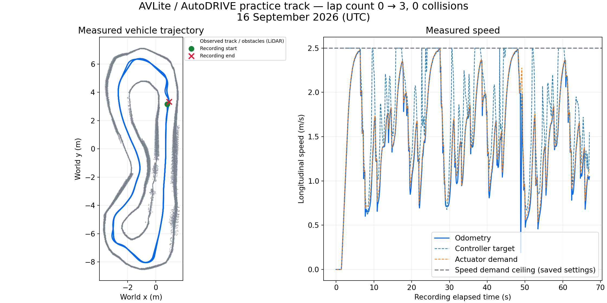
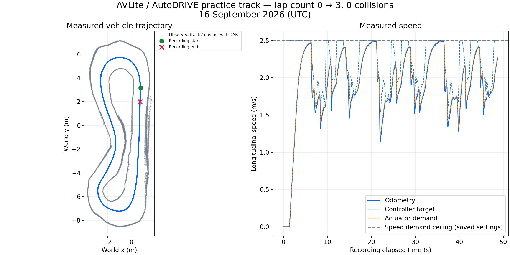
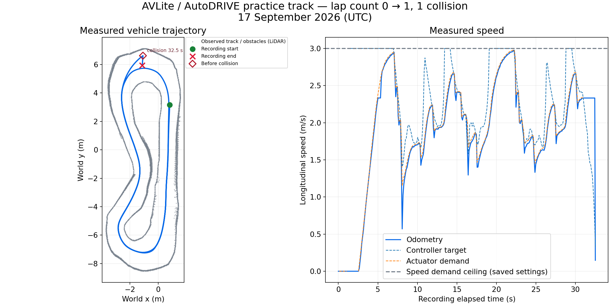
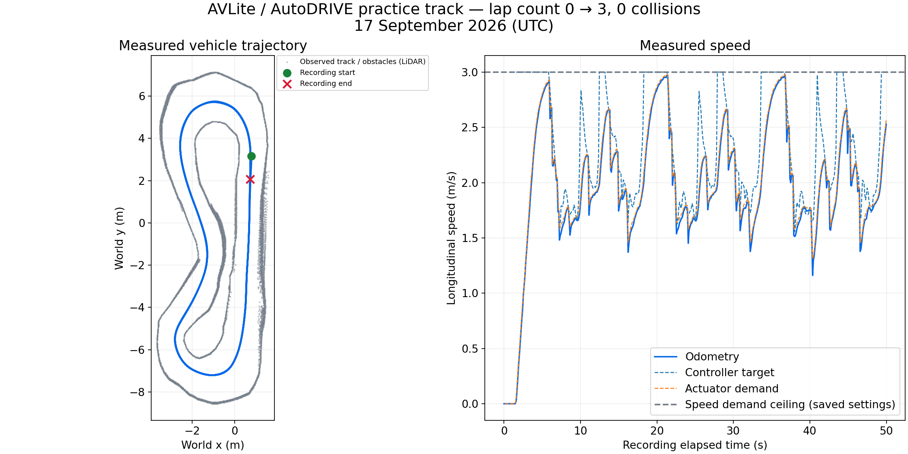

# AutoDRIVE RoboRacer — AVLite integration

Run AV-Lab's AVLite execution stack on the AutoDRIVE RoboRacer practice simulator.
The original LiDAR pure-pursuit controller is also available.

## Windows quick start

With Docker Desktop running Linux containers, run in PowerShell:

```powershell
.\run-windows.ps1
```

This downloads the official ICRA 2026 Windows practice simulator on first use,
builds AVLite, and opens the simulator. The native Windows simulator uses your
GPU; the bridge, actuator, and AVLite run in Docker. If needed, select
**Connection** (`127.0.0.1:4567`) and **Autonomous** in the simulator.
Downloads and simulator logs are stored under the ignored `log/windows/` folder.

```powershell
# Stop AVLite first, then the other services and simulator.
.\run-windows.ps1 -Stop

# Inspect controller logs.
docker compose -f docker-compose.avlite.yml -f docker-compose.windows.yml logs -f avlite actuator
```

## Shared speed and throttle settings

Edit [config/driving.yaml](config/driving.yaml) for the shared limits. The current
corner-preview candidate uses:

```yaml
speed_mps: 3.0
max_throttle: 0.2
```

`speed_mps` sets AVLite's cruise/max velocity and the actuator's speed-demand
limit together. `max_throttle` is a separate normalized throttle cap, not a speed.
The two profiles reference this file through `shared_settings: driving.yaml`
and `${...}` values, which the launchers resolve on startup.
The initial clean-lap validation used 0.5 m/s and a 0.02 throttle cap; the
[corner-preview comparison](#tests-and-improvements) below uses 2.5 m/s and 0.2.

After saving, reload both services (the simulator stays open):

```powershell
docker compose -f docker-compose.avlite.yml -f docker-compose.windows.yml restart avlite actuator
```

On Linux, omit `-f docker-compose.windows.yml`. Editing YAML needs no image
rebuild. When upgrading an existing installation to shared settings for the first
time, run `./run-windows.ps1` on Windows, or rebuild/recreate the services with
`docker compose -f docker-compose.avlite.yml up -d --build actuator avlite` on Linux.

## Test the corner-entry update (Windows)

The `preview-v2` candidate searches at least 1.5 m ahead for a turn while keeping
the shorter speed-dependent steering distance and tight-bend fallback. It keeps
the existing curvature/clearance speed caps and deceleration response.
The new profile completed its first three-clean-lap screen at 2.5 m/s, reducing
mean rolling lap time from 21.530 s to 15.333 s in the
[comparison below](#tests-and-improvements). The first **3.0 m/s** screen
completed one lap, then collided after actuator updates stopped during a
backward clock adjustment. With the steady-clock timer fix, the repeat completed
**three clean laps at 3.0 m/s**, including another clock adjustment. See the
[actuator before-and-after comparison](#reliable-actuator-updates--17-september-2026)
and [failure analysis](docs/checklist-2026-09-21.md#30-ms-test-actuator-update-interruption).
Final repeatability checks remain pending. See the
[settings and diagnostic guide](docs/avlite-setup.md#corner-entry-screening-candidate).

With the simulator open and connected, run:

```powershell
.\record-one-lap.ps1 -Laps 3 -Label preview-v2-3p0-steady
```

Reset when prompted. The script reloads the actuator, records up to three consecutive
laps, and stops AVLite if it detects a collision/reset or reaches the time limit.
It opens the path/speed graph; inspect `telemetry.control.png` in the same folder
for target speed, actual slowdown, throttle, clearance and timing, plus the new
preview-distance and target-bearing panels. Keep the entire folder when comparing
results. The first three-clean-lap screen at 3.0 m/s has passed;
the [checklist](docs/checklist-2026-09-21.md) tracks later speed steps and final
three-run, ten-lap acceptance separately.

New Windows recordings also draw the observed track boundaries and obstacles
behind the car's path. The recorder combines LiDAR hits with simulator world
poses and saves `telemetry.track.json`; a short run may show only part of the
track. Use `-NoTrackMap` to disable this optional capture. Older recordings have
no track geometry unless you supply an outline from another run on the same
track and world coordinates. See [track overlays](docs/avlite-setup.md#track-outline-on-the-path-graphs).

## Tests and improvements

### Earlier corner steering — 16 September 2026

Separating corner preview from steering distance reduced mean rolling lap time
by **6.20 s (28.8%)** in this comparison. Both recordings completed **three clean
laps with zero collisions or resets**, using the same **2.5 m/s speed demand
ceiling and 0.2 throttle cap**.

**Before: late turn selection (`corner-v1`).** The car followed a wider line at
both ends of the track and repeatedly slowed sharply. At the first bottom bend,
the steering command stayed at zero with 0.707 m of observed corridor clearance,
then reached the 30-degree limit at 0.604 m. Braking shortened the distance used
to search for an opening to 0.6 m, so straight ahead remained acceptable until
the car was close to the wall.



**What changed:**

- Added `racing.gap_preview_min_m: 1.5` in
  [config/avlite.yaml](config/avlite.yaml). The controller requests at least
  1.5 m of gap preview, capped at 1.8 m, even when braking reduces its steering
  distance.
- Kept the steering distance at `0.4 * measured_speed`, bounded to 0.6–1.8 m.
  The gap finder can still fall back to shorter visible openings in tight bends;
  steering and curvature speed limits use the actual shorter pursuit distance.
- Retained the speed/throttle limits, clearance braking and watchdogs. Added
  preview-distance and target-bearing diagnostics to distinguish turn selection
  from steering response. The algorithm is in
  [controller.py](src/avlite_autodrive/avlite_autodrive/plugin/controller.py).

**After: independent corner preview (`preview-v2`).** The recorded path rounds
both end bends earlier, and the speed trace avoids the repeated deep corner
slowdowns seen before. The measured peak speed is unchanged; the lap-time gain
comes with a different path and better speed retention through the bends.



| Measurement | Before | After |
| --- | --- | --- |
| Completed clean laps | 3 | 3 |
| Collisions / resets | 0 / 0 | 0 / 0 |
| Rolling lap times | 20.604 / 22.457 s | 15.069 / 15.597 s |
| Mean rolling lap time | 21.530 s | 15.333 s |
| Measured peak speed | 2.486 m/s | 2.486 m/s |

Rolling times measure intervals between consecutive observed finish crossings;
they exclude the initial standing-start lap. The plots include startup and the
one-second finish-feedback tail. Gray points are observed LiDAR surfaces placed
using simulator poses, providing an approximate track outline.

Saved evidence: [before summary](docs/validation/corner-preview/before.summary.json)
from `20260916-231003-523-corner-v1-2p5` and
[after summary](docs/validation/corner-preview/after.summary.json)
from `20260916-233141-867-corner-v1-2p5`. The latter reused the old run label;
its saved configuration and recorded preview diagnostics confirm `preview-v2`
was active. These are one three-lap recording per profile. The
[checklist](docs/checklist-2026-09-21.md) tracks further speed screening and the
final requirement of three fresh runs with ten clean laps each.

### Reliable actuator updates — 17 September 2026

Changing the actuator timer to a **steady clock** allowed the 3.0 m/s test to
finish **three clean laps with zero collisions or resets**. Both runs below used
the same 3.0 m/s speed ceiling, 0.2 throttle cap and 1.5 m corner preview.

**Before: actuator updates paused during a clock adjustment.** On lap two,
recorded UTC moved backward by about 2.11 s. AVLite continued asking for braking
and more steering, but the actuator stopped publishing updates. The car held
about 0.094 throttle and 5.25 degrees of steering, travelling at 2.33 m/s until
it hit the upper boundary. The last actuator command was 1.82 s old at impact.



**What changed:** the actuator's 20 Hz timer in
[adapter.py](src/avlite_autodrive/avlite_autodrive/adapter.py) now explicitly uses
`ClockType.STEADY_TIME`. The original timer followed the node's ROS/system clock,
so a backward clock adjustment could delay the next callback. Both actuator
publication and watchdog checks run in that callback. A steady clock measures
elapsed time independently of system-time corrections, allowing those checks
and commands to continue. Exactly one actuator timer runs; speed, preview and
braking settings were kept the same between these two tests.

**After: commands continued through another clock adjustment.** During the
repeat, recorded UTC moved backward by about 2.35 s, but the maximum sampled age
of the outgoing throttle/steering commands stayed below 56 ms. The car completed
all three laps and the upper bend without the earlier held-command failure.



| Measurement | Before: default timer | After: steady timer |
| --- | --- | --- |
| Completed laps / requested | 1 / 3 | 3 / 3 |
| Collisions / vehicle resets | 1 / 0 | 0 / 0 |
| Three-lap screening result | Failed | Passed |
| Maximum sampled outgoing command age | 1.822 s | 0.055 s |
| Rolling lap times | None completed | 15.375 / 15.693 s |
| Mean rolling lap time | Unavailable | 15.534 s |
| Measured peak speed | 2.976 m/s | 2.975 m/s |

This demonstrates improved command delivery through clock changes in the
recorded run. It does not establish a lap-time improvement: the earlier clean
2.5 m/s profile averaged 15.333 s, about 1.3% quicker than this run. Higher speed
settings still need tuning and repeatability testing. Clock adjustments also
remain visible in sensor timestamps; the timer fix does not correct their source.

An isolated adapter test also verified continued updates with ROS time paused
and moved backward, plus zero throttle/steering after inputs became stale.
Regression coverage lives in
[test_adapter_clock.py](src/avlite_autodrive/test/test_adapter_clock.py).
An independent bridge timeout and recorder checks for stale actuator outputs
remain on the [checklist](docs/checklist-2026-09-21.md#30-ms-test-actuator-update-interruption).

Saved evidence: [before summary](docs/validation/actuator-timing/before.summary.json)
from `20260917-075757-575-preview-v2-3p0` and
[after summary](docs/validation/actuator-timing/after.summary.json)
from `20260917-100851-863-preview-v2-3p0`. The run label was reused; the second
recording was made after the actuator timer correction. These are one recording
per version, and the failed version has no complete rolling lap for a timing
comparison. Final acceptance remains three fresh runs of ten clean laps each.

## Record laps and open the graph (Windows)

Start the simulator with `.\run-windows.ps1` and connect it, then run:

```powershell
.\record-one-lap.ps1
```

The script stops AVLite, reloads the actuator settings and asks you to reset the
car to the starting position.
Keep **Connection** and **Autonomous** selected, then press Enter in PowerShell.
Once fresh position and lap/collision counters arrive, the script starts AVLite
automatically. It stops AVLite when recording finishes and opens
`log\recordings\<dated-run>\telemetry.lap.png`, showing the path on the left and
measured speed on the right. The simulator, bridge and actuator stay running.

Recording ends after `-Laps` lap-counter increases (default 1) plus one second for
collision feedback, at the first detected collision/reset, or after 600 seconds.
The full feedback second must finish for a screening pass. Use `-MaxSeconds`,
`-Label`, or `-WaitForOdomSeconds` (default 30) to adjust the capture, and `-NoOpen`
to save the graph without opening it. For example:

```powershell
.\record-one-lap.ps1 -MaxSeconds 300 -Label controller-test -NoOpen
```

Reset before pressing Enter; starting mid-lap captures only the remainder, and
resetting during recording invalidates a clean-lap result. If the requested lap
count is not reached or the run is not confirmed clean, the script reports that
result. AVLite is also stopped if recording fails or you press Ctrl+C.

The graph's speed ceiling comes from the saved configuration snapshot;
it is not the controller's changing speed demand or a guaranteed physical limit.
The report describes the recorded interval and available lap evidence, including
partial runs. `telemetry.control.png` compares controller target, actuator demand
and measured speed, with clearance, lookahead, requested/measured acceleration,
throttle, saturation, collision/reset markers and controller timing.
`telemetry.png` also graphs measured speed, throttle
command/feedback, steering in radians, requested acceleration, the vehicle path,
and lap/collision/reset counters. Capture at about 10 Hz is intended for debugging
these signals; this is not a full camera/LiDAR replay recording.

Each folder also contains `telemetry.csv` for Excel, the original `telemetry.jsonl`,
a summary, copies of the configuration files, and controller logs. Samples have
both elapsed seconds and UTC timestamps. Stale readings appear as gaps in the
time-series plots. `telemetry.summary.json` reports `clean_run`, lap counts and
`lap_times_s` between consecutive observed finish crossings. The first crossing
is excluded from these rolling lap times; `first_lap_driving_s` separately measures
first detected motion to first crossing when recording began stationary.
Neither metric includes the feedback tail. Config copies reflect the files on
disk; this wrapper reloads both controllers before driving. Reload controllers
yourself before using the passive recorder after edits.

For a passive recording while you reproduce an issue, use:

```powershell
.\record-windows.ps1 -Seconds 120 -Label corner-test
```

This separate script only observes the run and leaves the car driving afterward.
Its `-Laps 3` option stops recording after three lap-counter increases;
`-StopAfterLap` remains the one-lap shorthand. Add `-StopOnIncident` to stop
recording after a collision/reset. These options do not start or stop AVLite.
Open the printed graph path when it finishes.

Finish starting or restarting the simulator, bridge and actuator before either
workflow. The recording timer starts after valid odometry arrives. Recording
fails if valid odometry then disappears for 10 seconds. If the bridge is replaced
during a run, rerun the recording command to attach to its new connection.
Keep the whole run folder when reporting a bug. These folders are ignored by Git.

The agreed racing and mapping milestones are saved in the
[September 21 plan](docs/plan-2026-09-21.md). Track progress and experiment results
in the [execution checklist](docs/checklist-2026-09-21.md).

## AVLite quick start

Requires Docker Compose, an NVIDIA GPU/container runtime, and a local X11 display.

```bash
# Stop the original controller before starting AVLite.
docker compose down
xhost +si:localuser:root
docker compose -f docker-compose.avlite.yml build
docker compose -f docker-compose.avlite.yml up -d
docker compose -f docker-compose.avlite.yml logs -f avlite actuator
```

This starts the simulator in batch mode and drives automatically once live LiDAR
and odometry arrive. Speed demand and normalized throttle are capped by
`config/driving.yaml`. These are controller limits, not guaranteed physical speed
bounds. The independent adapter commands zero if AVLite or sensor data stops.

Stop driving first, leaving the adapter and API alive to transmit zero:

```bash
docker compose -f docker-compose.avlite.yml stop avlite
sleep 1
docker compose -f docker-compose.avlite.yml down
```

See [setup and architecture](docs/avlite-setup.md), the
[saved implementation plan](docs/avlite-integration-plan.md), and
[measured validation results](docs/avlite-validation.md).

## Original controller quick start

```bash
# Allow X11 forwarding (run once per session)
xhost local:root

# Pull images (first time only)
docker pull autodriveecosystem/autodrive_roboracer_sim:2026-icra-practice
docker pull autodriveecosystem/autodrive_roboracer_api:2026-icra-practice

# Start both containers
docker compose up
```

In the simulator GUI: leave IP as `127.0.0.1` and port `4567`, click **Connection**, then click **Driving Mode → Autonomous**.

## Development workflow

```bash
# Open interactive shells
docker compose -f docker-compose.yml -f docker-compose.dev.yml run --rm devkit

# Inside the container — build and run your package
colcon build --packages-select my_team_racer
source install/setup.bash
ros2 launch my_team_racer racer.launch.py
```

Source files on your host under `src/` are mounted at `/home/autodrive_devkit/src/my_packages` — edits are visible immediately.

## Algorithm

`racer_node.py` implements a wall-following pure pursuit controller:

1. Parse the 270° LaserScan into cartesian points
2. Separate left / right wall points in the forward hemisphere
3. Compute lateral offset from the track centerline
4. Project a lookahead point `LOOKAHEAD_DIST` metres ahead along the centerline
5. Steer toward that point using pure-pursuit geometry
6. Scale throttle inversely with steering magnitude (slow in corners)

Key tuning constants at the top of [racer_node.py](src/my_team_racer/my_team_racer/racer_node.py):

| Constant | Default | Effect |
|---|---|---|
| `LOOKAHEAD_DIST` | `0.8 m` | Longer = smoother but lazier |
| `MAX_THROTTLE` | `0.4` | Throttle ceiling on straights |
| `WHEELBASE` | `0.32 m` | Vehicle length used in steering geometry |
| `THROTTLE_DECAY` | `3.0` | Throttle reduction in corners |

## ROS 2 topics

| Topic | Direction | Type |
|---|---|---|
| `/autodrive/roboracer_1/lidar` | Subscribe | `sensor_msgs/LaserScan` |
| `/autodrive/roboracer_1/throttle_command` | Publish | `std_msgs/Float32` |
| `/autodrive/roboracer_1/steering_command` | Publish | `std_msgs/Float32` |

## Competition submission

```bash
# Commit your devkit container as a new image
docker commit -m "racing algorithm" autodrive_roboracer_api <dockerhub_user>/<repo>:2026-icra-practice
docker push <dockerhub_user>/<repo>:2026-icra-practice
```

The `docker/autodrive_devkit.sh` script is the entrypoint for your submitted image — it builds and launches the racer automatically without touching `~/.bashrc`.
