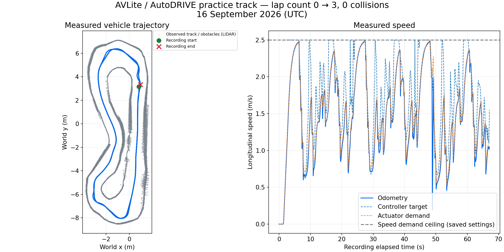
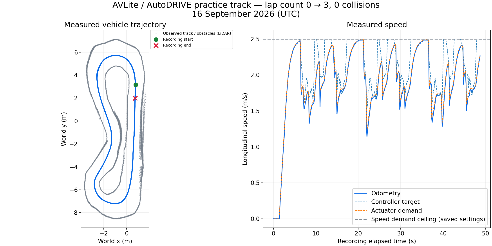
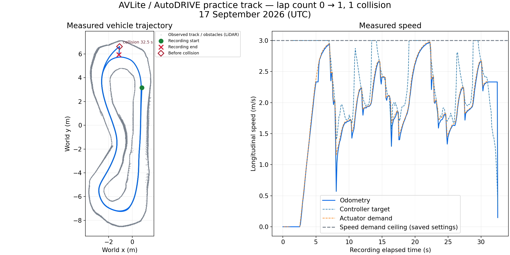
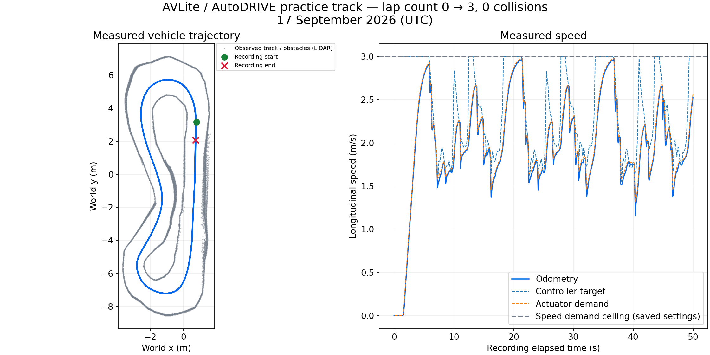

# AutoDRIVE RoboRacer with AVLite

Autonomous racing in the AutoDRIVE practice simulator using AVLite plugins.
Choose reactive Follow the Gap or a mapped race planner with Pure Pursuit.
Both currently use simulator ground-truth localization.

## Start and record on Windows

With Docker Desktop running Linux containers, run from this repository:

```powershell
.\run-windows.ps1
```

The script downloads the Windows simulator on first use, builds the containers
and opens the simulator window. Unity runs on Windows using your GPU; the bridge,
AVLite and actuator run in Docker. Select **Connection** (`127.0.0.1:4567`)
and **Autonomous** in the simulator. The controller can then start driving.

To record a three-lap test:

```powershell
.\record-one-lap.ps1 -Laps 3 -Label controller-test
```

Reset when prompted, then press Enter. The script reloads the controllers,
records before driving, and stops AVLite after the requested laps, an incident
or timeout. It opens the path/speed graph with the observed LiDAR track outline.
Keep the complete `log/recordings/<run>` folder for analysis.

```powershell
# Stop the stack and simulator.
.\run-windows.ps1 -Stop

# Inspect controller logs.
docker compose -f docker-compose.avlite.yml -f docker-compose.windows.yml logs -f avlite actuator
```

See [setup and recording](docs/avlite-setup.md) for Linux, passive recording,
graph fields and troubleshooting, or [restart commands](Restart.md).

## Settings and algorithm source

| Change | File |
| --- | --- |
| Shared speed ceiling and normalized throttle cap | [config/driving.yaml](config/driving.yaml) |
| Driving mode, preview, planner and vehicle geometry | [config/avlite.yaml](config/avlite.yaml) |
| Actuator gains and timeout | [config/actuator.yaml](config/actuator.yaml) |
| Our driving algorithms and AVLite adapters | [plugin package](src/avlite_autodrive/avlite_autodrive/plugin) |
| Original standalone controller | [racer_node.py](src/my_team_racer/my_team_racer/racer_node.py) |

Restart both `avlite` and `actuator` after shared-setting changes, or use the
recording script, which handles the reload. YAML edits need no image rebuild.
Upstream AVLite is installed inside the container; see
[source locations and architecture](docs/avlite-setup.md#what-runs-and-where-to-edit).

As checked on 20 September 2026, the working profile selects `planned`, requests
20 m/s and caps throttle at 0.2. Uncalibrated planned driving adds a **2.5 m/s
commissioning ceiling**. These are demand limits; measured speed can differ.
Before enabling calibrated braking, replace 20 m/s with the next controlled
test ceiling. See [planned driving](docs/planned-driving.md).

## Current progress and next work

The planner and telemetry tools work, and three-lap screens have passed.
The first response test completed four clean laps but produced **zero qualifying
coast measurements**: the slowdown was too brief for the current capture and
duration criteria. Improve that measurement before lifting the commissioning cap.
Details are in [response measurements](docs/response-measurements.md).

The [checklist](docs/checklist-2026-09-21.md) tracks braking calibration,
measured speed toward 5 m/s, three fresh ten-lap runs, and mapping/localization.
The [milestone plan](docs/plan-2026-09-21.md) defines acceptance.
[Jetson preparation](docs/real-car-plugin-plan.md) covers the proposed hardware
plugin and remote operation; those components are not implemented yet.

## Tests and improvements

### Earlier corner steering — 16 September 2026

Both runs used a 2.5 m/s ceiling and 0.2 throttle cap. Before the change, braking
shortened the gap-search distance to 0.6 m. At the first bottom bend, steering
stayed at zero with 0.707 m of corridor clearance, then reached its 30° limit
at 0.604 m.

**Before: late turn selection and repeated sharp slowdown.**



**Change:** separate preferred gap preview from steering distance:

$$
L_{\mathrm{steer}}=\mathrm{clip}(0.4v,\ 0.6,\ 1.8),\qquad
L_{\mathrm{preview}}=\min(1.8,\ \max(L_{\mathrm{steer}},1.5)).
$$

Distances are metres and $v$ is measured speed in m/s; the gain is 0.4 seconds.
The gap finder retains a shorter-distance fallback for tight bends.
[controller.py](src/avlite_autodrive/avlite_autodrive/plugin/controller.py)
keeps the existing speed limits and adds preview/bearing diagnostics.

**After: earlier turn selection and better speed retention through the bends.**



| Measurement | Before | After |
| --- | --- | --- |
| Clean laps; collisions / resets | 3; 0 / 0 | 3; 0 / 0 |
| Rolling lap times | 20.604 / 22.457 s | 15.069 / 15.597 s |
| Mean rolling lap time | 21.530 s | 15.333 s |
| Measured peak speed | 2.486 m/s | 2.486 m/s |

$$
\text{Lap-time reduction}=\frac{21.530-15.333}{21.530}\times100\%=28.8\%.
$$

This is one three-lap run per profile. Rolling times exclude the standing-start
lap; [timing definitions](docs/avlite-setup.md#lap-timing) explain the calculation.
Detailed steering-onset and clearance validation remain open.

### Reliable actuator updates — 17 September 2026

Both runs used a 3.0 m/s ceiling, 0.2 throttle cap and 1.5 m preview.
Before the fix, UTC moved backward by about 2.11 s and actuator updates paused.
The car held its previous commands until it collided on lap two; the outgoing
command was 1.822 s old at impact.

**Before: actuator publication stopped during a clock adjustment.**



**Change:** the 20 Hz timer in
[adapter.py](src/avlite_autodrive/avlite_autodrive/adapter.py) uses
`ClockType.STEADY_TIME`. Publication and watchdog checks can continue through
system-clock corrections. Driving settings were unchanged.

**After: three clean laps, including another 2.35 s backward clock adjustment.**



| Measurement | Before | After |
| --- | --- | --- |
| Completed / requested laps | 1 / 3 | 3 / 3 |
| Collisions / resets | 1 / 0 | 0 / 0 |
| Maximum sampled outgoing command age | 1.822 s | 0.055 s |
| Rolling lap times | None completed | 15.375 / 15.693 s |
| Mean rolling lap time | Unavailable | 15.534 s |
| Measured peak speed | 2.976 m/s | 2.975 m/s |

The repeat supports the scheduling fix, but its mean was slower than the earlier
2.5 m/s run's 15.333 s. It does not establish a lap-time gain or fix sensor-clock
corrections. [Regression coverage](src/avlite_autodrive/test/test_adapter_clock.py)
also checks paused/backward clocks and stale-input stopping. Independent bridge
command expiry remains on the [checklist](docs/checklist-2026-09-21.md#timing-follow-up).

### Recording references

Raw folders under `log/recordings/` are ignored by Git. Published graphs and
summaries are intentional copies so this page works on GitHub. An 18 September
SHA-256 audit found no duplicate recordings and verified all eight comparison
assets against their originals.

| Evidence | Original recording folder | Published summary/report |
| --- | --- | --- |
| Corner preview: before | `20260916-231003-523-corner-v1-2p5` | [Summary](docs/validation/corner-preview/before.summary.json) |
| Corner preview: after | `20260916-233141-867-corner-v1-2p5` | [Summary](docs/validation/corner-preview/after.summary.json) |
| Actuator timing: before | `20260917-075757-575-preview-v2-3p0` | [Summary](docs/validation/actuator-timing/before.summary.json) |
| Actuator timing: after | `20260917-100851-863-preview-v2-3p0` | [Summary](docs/validation/actuator-timing/after.summary.json) |
| First planned screen | `20260917-182353-462-planned-commissioning-2p5` | [Historical report](docs/validation/planned-commissioning.md); raw folder unavailable |
| Latest ordinary planned run | `20260918-001910-306-preview-v2-3p0-planned` | Local only; three clean laps, 13.754 s rolling mean |
| First response test | `20260919-101719-674-response-1p5` | [Findings](docs/response-measurements.md#latest-result); raw data local |

Folder labels are descriptive only. The corner-preview “after” run reused the
old `corner-v1` label; the September 18 `3p0` run actually had a 2.5 m/s effective
cap. Its 13.754 s mean belongs to a different run from the historical planned
screen's 12.613 s. The initial 0.5 m/s baseline has its own
[report, graph and telemetry](docs/avlite-validation.md).
