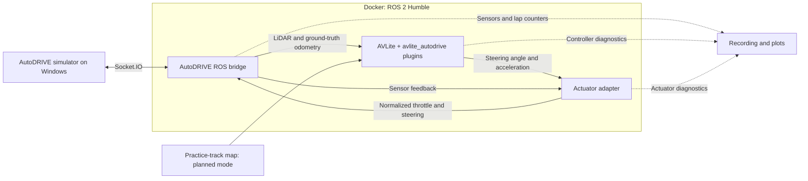

# AutoDRIVE RoboRacer with AVLite

AVLite plugins for autonomous racing, developed against the AutoDRIVE simulator
before deployment to a real car. The stack supports Follow the Gap and a mapped
race planner with Pure Pursuit. Localization currently uses simulator ground truth.

## Project architecture

### Current simulator system

On Windows, Unity runs natively. Docker runs three services: the AutoDRIVE ROS
bridge, AVLite with our plugins, and an independent actuator adapter.


```mermaid
flowchart LR
    Sim["AutoDRIVE simulator on Windows"]
    subgraph Docker["Docker: ROS 2 Humble"]
        Bridge["AutoDRIVE ROS bridge"]
        AVLite["AVLite + avlite_autodrive plugins"]
        Actuator["Actuator adapter"]
        Bridge -->|LiDAR and ground-truth odometry| AVLite
        AVLite -->|Steering angle and acceleration| Actuator
        Actuator -->|Normalized throttle and steering| Bridge
        Bridge -->|Sensor feedback| Actuator
    end
    Sim <-->|Socket.IO| Bridge
    Map["Practice-track map: planned mode"] --> AVLite
    Bridge -.->|Sensors and lap counters| Telemetry["Recording and plots"]
    AVLite -.->|Controller diagnostics| Telemetry
    Actuator -.->|Actuator diagnostics| Telemetry
```

[runner.py](src/avlite_autodrive/avlite_autodrive/runner.py) selects Follow the Gap
or the mapped planner with Pure Pursuit. The
[world bridge](src/avlite_autodrive/avlite_autodrive/plugin/bridge.py) translates
ROS sensor messages into AVLite inputs and publishes controller commands.
Both the controller and [actuator](src/avlite_autodrive/avlite_autodrive/adapter.py)
target 20 Hz; the actuator uses its own timer and timeout checks.

The internal `/avlite/control_command` message carries steering in radians and
acceleration in m/s²; its `speed` field is unused. The actuator converts those
commands into simulator inputs. Reducing throttle to zero is the current
deceleration action, not a calibrated physical brake command.

The [recording script](scripts/windows/laps.ps1) manages test capture and produces path,
speed and control plots. Its LiDAR track outline uses simulator ground-truth
poses; it is not an implemented mapping/localization system for the real car.

### Real car (Jetson)

[`src/avlite_roboracer`](src/avlite_roboracer/) implements the
[localization plan](docs/plans/LOCALIZATIONPLAN.md). The car drives one slow
autonomous lap while SLAM Toolbox maps the track, then stops. While stopped, it
builds and validates the map, racing line and localization, and reports READY.
Racing starts only on an explicit `race-start` from the laptop. The package also
provides the hardware profile, synchronized recording and replay, and the
localization-quality report.

**It has not yet run on the Jetson.** The hardware profile is unfilled, so the
supervisor refuses autonomous motion until commissioning measurements are entered.
See the [Jetson guide](docs/jetson.md) for the workflow, commands and outstanding
validation.

## Start here

New teammates: read [CONTRIBUTING](CONTRIBUTING.md). On Windows, install Git,
use PowerShell 5.1 or later, and start Docker Desktop with Linux containers.
AVLite and ROS run inside Docker.

All Windows operations use [avlite.ps1](avlite.ps1). Run these commands from the
repository root:

```powershell
.\avlite.ps1 help
.\avlite.ps1 start
.\avlite.ps1 laps -Laps 3 -Label controller-test
.\avlite.ps1 stop
```

After `start` opens the simulator, select **Connection** (`127.0.0.1:4567`)
and **Autonomous**. The lap command prompts
for a reset, starts recording before driving, and stops AVLite after the lap
limit, an incident or timeout. Reports are saved in `log/recordings/`.

The current setup uses the original **practice track** with `maps/practice.json`.
With no `config/windows-simulator.json` override, the launcher opens the stock
practice simulator and downloads it if needed. Unity Editor is not required for
this workflow. The custom sketch track remains available through
[sketch setup](docs/sketch-track.md). The simulator scene and AVLite map must match.

See the [command reference](docs/commands.md) for options and migration from the
old scripts, or the [documentation index](docs/README.md) for all guides.

## Common commands

| Task | Command |
| --- | --- |
| List commands or inspect lap options | `.\avlite.ps1 help` or `.\avlite.ps1 laps -Help` |
| Check containers | `.\avlite.ps1 status` |
| Stream controller and bridge logs | `.\avlite.ps1 logs -Follow` |
| Reload controller settings and resume driving | `.\avlite.ps1 restart` |
| Record three laps, stopping on an incident or timeout | `.\avlite.ps1 laps -Laps 3 -Label controller-test` |
| Record an already running car without stopping it | `.\avlite.ps1 record -Seconds 120 -Label corner-test` |
| Inspect the configured speed profile without driving | `.\avlite.ps1 speed` |
| Measure low-speed braking response | `.\avlite.ps1 response -TargetSpeedMps 2.5 -Trials 3` |
| Run Windows workflow tests with Docker mocked | `.\avlite.ps1 test` |

Map conversion, saved-recording analysis and Unity track development use the
`map`, `response`, `sketch-map`, `sketch-build` and `sketch-test` commands.
Their prerequisites and examples are in the [command reference](docs/commands.md).
The guided response controller supports tests at 1.0-2.5 m/s; its speed argument
does not set the normal racing ceiling.

## Settings and diagnostics

| Change | File |
| --- | --- |
| Shared speed ceiling and normalized throttle cap | [config/driving.yaml](config/driving.yaml) |
| Driving mode, map, planner and vehicle geometry | [config/avlite.yaml](config/avlite.yaml) |
| Actuator gains and timeouts | [config/actuator.yaml](config/actuator.yaml) |
| Optional custom simulator selection | `config/windows-simulator.json`; absent for the default practice build |

After YAML edits, run `.\avlite.ps1 restart` to reload both controllers; this
resumes driving when sensors are ready. The `laps` command also reloads settings
before recording. YAML edits do not require an image rebuild. `speed_mps` is a ceiling;
corners, acceleration, braking and obstacle checks can lower the target. Profiles
with `braking_calibrated: false` also enforce a 2.5 m/s commissioning ceiling.
Use the [response workflow](docs/response-measurements.md) to evaluate braking.
Dated test results describe their original profiles, not the current settings.

## Repository map

| Location | Purpose |
| --- | --- |
| [avlite.ps1](avlite.ps1) | Single Windows command entry point |
| [src/avlite_autodrive/](src/avlite_autodrive/) | Main integration, plugins and Python/ROS tests |
| [src/avlite_roboracer/](src/avlite_roboracer/) | Jetson recording, SLAM Toolbox mapping/localization, supervisor and actuator |
| [config/roboracer/](config/roboracer/) | Jetson hardware profile, racing profile and SLAM Toolbox settings |
| [scripts/jetson/](scripts/jetson/) | Supervisor CLI wrapper used over SSH |
| [config/](config/) | Shared settings, control profiles and race maps |
| [scripts/windows/](scripts/windows/) | Command implementations, shared paths and command registry |
| [scripts/linux/](scripts/linux/) | Legacy Linux test runner |
| [tests/](tests/) | Windows command and recording workflow tests |
| [tools/unity/](tools/unity/) | Unity scene generation and native checks |
| [assets/tracks/](assets/tracks/) | Track meshes, metadata and generation sources |
| [docs/](docs/README.md) | Working guides, plans, research and validation history |
| [docs/plans/](docs/plans/) | Milestone, implementation checklist and real-car plan |
| [docs/validation/](docs/validation/) | Curated graphs and dated test evidence |
| [docs/research/](docs/research/) and [docs/history/](docs/history/) | Research notes and original integration plan |
| [docker/](docker/) | Pinned runtime build; older Compose setup in `legacy/` |
| [src/my_team_racer/](src/my_team_racer/) | Original standalone controller, retained with its tests |
| `log/` | Local recordings, native builds and logs; simulator builds/downloads are ignored |

The root [docker-compose.avlite.yml](docker-compose.avlite.yml) runs AVLite;
[docker-compose.windows.yml](docker-compose.windows.yml) supplies its Windows override.
Linux setup and architecture are in [setup and recording](docs/avlite-setup.md).
The original controller's separate Compose setup requires the instructions in
[docker/legacy](docker/legacy/README.md).

## Updating an existing checkout

The old root PowerShell scripts have been replaced. Update saved commands and
shortcuts to use the launcher:

`measure-response.ps1` remains a compatibility wrapper for saved commands and
delegates to the current response workflow.

| Old command | New command |
| --- | --- |
| `.\run-windows.ps1` | `.\avlite.ps1 start` |
| `.\run-windows.ps1 -Stop` | `.\avlite.ps1 stop` |
| `.\record-one-lap.ps1 -Laps 3` | `.\avlite.ps1 laps -Laps 3` |
| `.\record-windows.ps1` | `.\avlite.ps1 record` |
| `.\measure-response.ps1` | `.\avlite.ps1 response` |
| `.\check-speed.ps1` | `.\avlite.ps1 speed` |

The [full migration table](docs/commands.md#migration-from-the-old-commands) covers
map, track-building and analysis commands. Braking analysis is now part of
`response -RecordingDirectory <run> -CoastOnly`, and the former `Restart.md`
instructions are in the command guide.

Legacy Compose files moved to `docker/legacy/`; their commands require
`--project-directory .` when run from the repository root. Track source files
remain in `assets/tracks/sketch_track/`. The redundant source ZIP was removed
after verifying that its eight files matched these extracted assets.
Recordings and locally built simulators remain under `log/`.

## Disk usage

The source, settings, track assets and documentation occupy about **7 MiB**.
Local simulator files and recordings account for most of a working folder's size:

| Local files | Approximate size | Needed for |
| --- | --- | --- |
| `log/windows/practice/` | 450 MiB | Running the original practice simulator |
| `log/windows/sketch/` when built | 295 MiB | Running the optional sketch simulator |
| `log/recordings/` | Grows with each run | Replotting, comparisons and debugging |

The launcher deletes the practice download ZIP after successful extraction.
Keep only the simulator builds you use. The unused sketch build was removed
during cleanup; recreate it with `.\avlite.ps1 sketch-build` before selecting
that track again. Its source assets, map and Unity tools remain in the repository.

Full recordings are retained locally. Share selected reports through
`docs/validation/`; simulator builds and download archives are excluded from Git
and Docker's build context.

## Progress and validation

Follow the [implementation checklist](docs/plans/checklist-2026-09-21.md) and
[acceptance milestone](docs/plans/milestone-2026-09-21.md). Hardware integration
follows the [localization plan](docs/plans/LOCALIZATIONPLAN.md); see the
[Jetson guide](docs/jetson.md) for its status.

Measured results are collected under [docs/validation/](docs/validation/), including
[earlier controller comparisons](docs/validation/controller-history.md), the
[practice-track speed assessment](docs/validation/high-speed-20260922.md), and
[sketch scene validation](docs/validation/sketch-track-20260924.md).

Run `.\avlite.ps1 test` for Windows workflow tests. See
[CONTRIBUTING](CONTRIBUTING.md#check-a-change) for Python/ROS checks.
