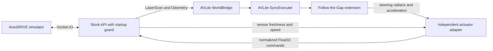

# AVLite on AutoDRIVE

## What runs

This integration uses [AV-Lab/avlite](https://github.com/AV-Lab/avlite) at commit
`1653f592b2eb5289a14c0d1041e50fdea855322a` (package version 0.6.3).
`SyncExecuter` invokes the real AVLite Follow-the-Gap controller, including its
Pure Pursuit steering and velocity PID, against a ROS-backed `WorldBridge`.
The simulator supplies ground-truth localization; mapping, SLAM, global planning,
and AVLite's dashboard are not enabled for this initial reactive driving setup.



The four services in `docker-compose.avlite.yml` are a standalone workflow.
Do not combine it with the original Compose file. Both controllers share the
same actuator topics and only one may run at a time.

## Setup and running

Use Linux with Docker Compose v2, the NVIDIA Container Toolkit, the two AutoDRIVE
`2026-icra-practice` images, and an X11 display. Unity Hub and a Unity Editor
license are not needed to run the prebuilt simulator. Internet access is required
for the first build. Run from the repository root:

```bash
docker compose down
xhost +si:localuser:root
docker compose -f docker-compose.avlite.yml build
docker compose -f docker-compose.avlite.yml up -d
docker compose -f docker-compose.avlite.yml logs -f avlite actuator
```

The batch-mode simulator connects automatically to port 4567. `Sensors ready`
and adapter `active` indicate that commands can flow. The simulator uses GPU
rendering even though it runs in batch mode. A startup packet can lack LiDAR;
the small API wrapper replies with zero commands until all required fields exist,
then delegates to the unmodified stock API. No synthetic sensor values are sent.

The source package and YAML configuration are mounted read-only into containers.
After editing code or configuration, restart the affected services. Restart AVLite
after changing its profile, and the adapter after changing actuator gains.
Restart both after editing the shared `config/driving.yaml` file.
Rebuild when changing the Dockerfile or dependencies.

## Topics, frames and units

| Interface | Meaning |
| --- | --- |
| `/autodrive/roboracer_1/lidar` | ROS `LaserScan`; 270-degree scan, nominal 1,080 beams |
| `/autodrive/roboracer_1/odom` | Ground-truth world pose and body-frame longitudinal velocity |
| `/avlite/control_command` | `AckermannDriveStamped`; steering in radians, acceleration in m/s²; `speed` is unused |
| `/avlite/controller_diagnostics` | JSON `String`; target speed, speed caps, lookahead, clearance, saturation and timing |
| `/avlite/actuator_diagnostics` | JSON `String`; actuator demand, braking/throttle state and input freshness |
| `/autodrive/roboracer_1/throttle_command` | Forward normalized `Float32`, constrained to `[0, max_throttle]` from `config/driving.yaml` |
| `/autodrive/roboracer_1/steering_command` | Normalized `Float32` in `[-1, 1]`, positive left |
| `/autodrive/reset_command` | `Bool`; clears controller readiness and actuator integrators |
| `.../lap_count`, `.../collision_count` | Simulator counters used to validate a run |

The vehicle origin is the rear axle. Wheelbase is 0.324 m. LiDAR is mounted at
`[0.2733, 0, 0.096]` m in the vehicle frame, with identity rotation. Scan points
use x forward and y left; AVLite applies the mounting transform exactly once.
Odometry twist is already in vehicle coordinates, so velocity is **not** rotated
by the world yaw. Steering normalization divides by 30 degrees in radians.

Positive infinite ranges become maximum-range returns. Invalid or below-minimum
ranges become near returns rather than clear space. A scan needs at least 50%
valid finite returns to permit driving. Missing, invalid or stale scans stop
command generation. This conservative policy may stop on unusually open scenes.

AVLite's upstream gap finder examines gaps between point bearings. This repository
extends it to find a clear vehicle-width corridor in a dense angular scan. The
extension selects a range-based target, smooths within the selected opening,
reduces speed in turns, and requests deceleration when no opening is available.
The upstream controller still computes the steering angle and acceleration.

## Corner-entry screening candidate

The `preview-v2` candidate keeps `speed_mps: 2.5`, `max_throttle: 0.2` in
`config/driving.yaml`. Its first three-lap screen passed with zero collisions or
resets, reducing mean rolling lap time from 21.530 s to 15.333 s against the
previous coupled-lookahead profile. See the
[before-and-after graphs](../README.md#tests-and-improvements). Higher-speed
screening and the final repeatability checks remain pending.

In `config/avlite.yaml`, the steering pursuit distance starts at
`0.4 * measured_speed`, bounded to 0.6–1.8 m. Gap selection now requests the
larger of that distance and `gap_preview_min_m: 1.5`, capped at the 1.8 m maximum.
Slowing down can therefore shorten the steering distance without removing the
longer view used to choose a turn. If that preview has no suitable opening, the
existing six-step search tries shorter distances down to the 0.6 m minimum.
The actual steering distance is the smaller of its original value and the
selected preview distance. Steering and curvature speed caps both use that
actual distance.

The speed target is capped using target curvature and observed clearance, with
these initial `racing` settings:

| Setting | Initial value | Role |
| --- | --- | --- |
| `gap_preview_min_m` | 1.5 | Preferred minimum gap-search distance, with shorter fallback |
| `lateral_acceleration_mps2` | 3.0 | Curvature-based corner speed cap |
| `braking_deceleration_mps2` | 1.5 | Assumed slowing response for the clearance speed cap |
| `reaction_time_s` | 0.25 | Distance allowed for response delay |
| `clearance_margin_m` | 0.15 | Clearance reserved before calculating speed |

These are tuning seeds, not measured grip or braking capability. The clearance
cap accounts for reaction distance plus braking distance; it examines straight
corridors along the current heading and selected target ray. It does not check a
full curved vehicle footprint or know upcoming mapped track curvature. Measure
the actual slowdown and inspect both bends before increasing the speed target.
Removing only `gap_preview_min_m` restores the previous coupled gap/steering
lookahead behavior while retaining the existing racing speed caps.

The [Nav2 regulated pure pursuit guide](https://docs.nav2.org/jazzy/configuration_and_development/configuration_guide/controller_plugins/configuring_regulated_pp/)
is background for speed-scaled lookahead and curvature-based slowdown. This
candidate extends the existing AVLite plugin; it does not import the Nav2 controller.

With the simulator open and connected, run:

```powershell
.\record-one-lap.ps1 -Laps 3 -Label preview-v2-2p5
```

Reset at the prompt and leave **Connection** and **Autonomous** selected. Inspect
`telemetry.lap.png` for path/speed and `telemetry.control.png` for the controller
target, actuator demand, measured speed, clearance, lookahead, acceleration and
throttle. Its new panels compare requested/selected gap preview with steering
distance, mark fallback use, and show raw versus smoothed gap-target bearings.
Those bearings describe the chosen direction relative to the car, separately
from the wheel steering command and feedback. Older recordings without these
fields keep their original layout.

Compare steering onset against the track outline, time at the steering limits,
corner speed and rolling lap times. Check for inside-corner cutting as well as
late steering. Record the result in the
[checklist](checklist-2026-09-21.md); only advance after three clean laps with the
same profile. Final acceptance remains three fresh runs of ten clean laps each.

## Actuator conversion and stopping

`config/driving.yaml` is the shared source for `speed_mps` and `max_throttle`.
The AVLite and actuator profiles use `shared_settings: driving.yaml` with
`${speed_mps}` / `${max_throttle}` references. Paths are relative to each profile,
and the launchers resolve the references to numbers before starting either node.
Speed must be finite and positive; throttle must be finite and in `(0, 1]`.
Missing files, unknown references, and invalid shared settings fail startup.

`config/avlite.yaml` contains the remaining small-car AVLite settings.
`config/actuator.yaml` contains the remaining adapter limits and speed gains.
Load the latter with `python3 -m avlite_autodrive.adapter --config /config/actuator.yaml`;
ROS's raw `--params-file` parser does not resolve these references. Plain numeric
ROS parameter files and `--ros-args` overrides remain supported.

The adapter integrates AVLite acceleration into a speed demand, capped by the
shared `speed_mps`, then tracks it with feedforward plus PI speed feedback. Acceleration is
never interpreted directly as normalized throttle. Gains were calibrated against
the practice simulator; do not assume they apply to a real car or another model.
The recorded clean-lap validation used 0.5 m/s and a 0.02 throttle cap; changes to
the shared settings do not extend those measured results to higher speeds.

The current adapter immediately commands zero forward throttle when requested
acceleration is at or below `-0.1 m/s²`, controlled by
`braking_acceleration_threshold` in `config/actuator.yaml`. It also clears the PI
integrator and reconciles speed demand with feedback during braking. Actual
zero-throttle deceleration still needs to be measured in the simulator.

The adapter runs at 20 Hz and requires commands, odometry and scans less than
0.5 seconds old. It rejects non-finite commands, stale command timestamps and
invalid odometry; resets on pose jumps; and commands zero if another publisher
appears on either actuator topic. Shut down the competing controller: publishing
zero cannot reliably override a second publisher that continues sending motion.

```bash
# Stop commands, let the independent watchdog send zero, then stop everything.
docker compose -f docker-compose.avlite.yml stop avlite
sleep 1
docker compose -f docker-compose.avlite.yml down
```

The adapter also publishes zero during graceful SIGINT/SIGTERM shutdown. Killing
the adapter or losing the ROS/API connection is outside its watchdog protection:
the stock API can retain its last command. Zero throttle is a braking request in
this simulator, not an instantaneous stop guarantee. This is a simulator setup,
not a validated hardware control system.

To switch back, stop the AVLite workflow, then run `docker compose up` and follow
the original simulator GUI instructions in the README.

## Recording a lap

On Windows, start the simulator with `.\run-windows.ps1`, select **Connection**,
and run:

```powershell
.\record-one-lap.ps1
```

The script checks that the bridge and actuator are running and that AVLite has
been created. It stops AVLite, restarts the actuator to load edited settings,
then asks you to reset the car to the starting position. Keep **Connection** and
**Autonomous** selected and press Enter in PowerShell. The recorder starts first;
AVLite starts automatically once fresh
odometry and the initial lap/collision counters arrive. No second terminal is
needed.

Capture ends after `-Laps` lap-counter increases (default 1) plus one second for
collision feedback, at the first collision/reset, or at the time limit. The full
feedback second is required for a screening pass. The script stops AVLite when
recording finishes, fails, or is cancelled with Ctrl+C, and leaves the simulator, bridge and actuator
running. It opens `telemetry.lap.png` automatically after a successful capture.

Defaults are `-Laps 1`, `-MaxSeconds 600`, and `-WaitForOdomSeconds 30`.
The default label is `one-lap` or `<Laps>-laps` for a multi-lap run.
Add `-NoOpen` to save the graph without opening it:

```powershell
.\record-one-lap.ps1 -MaxSeconds 300 -Label controller-test -NoOpen
```

Reset before pressing Enter. A recording begun mid-lap contains only that lap's
remainder; resetting during capture invalidates a clean-lap result. The script
reports when the target was not reached or a clean run could not be confirmed,
even if the requested duration completed normally. Missing or stale lap/collision
telemetry cannot pass screening; counter resets and skipped counts invalidate it.

Each capture saves a dated folder in `log/recordings/` with `telemetry.lap.png`
for the recorded path and measured speed, `telemetry.control.png` for corner-entry
diagnostics, `telemetry.png` for the original debugging graphs, CSV, raw JSONL,
summary, configuration snapshots, and controller logs. Diagnostics include
collision/reset markers, steering/throttle saturation, controller timing and
sensor ages. The measured acceleration trace is a finite difference of recorded
speed, with stale data and incident jumps excluded; it is not a calibrated
acceleration sensor. The wrapper reloads both controllers before driving;
snapshots describe files on disk.
Wait for simulator, bridge and actuator startup or restart to finish before
recording. The recorder waits for valid odometry before starting the requested
duration (`-WaitForOdomSeconds` on Windows, `--wait-for-odom` in Python). A 10-second
loss of valid odometry ends capture with an error and preserves partial JSONL and
the summary. Replacing the bridge leaves an existing recorder on the old network
connection; start a new recording after the restart. A stationary car still sends
odometry and can be recorded normally.

For passive debugging capture, use
`.\record-windows.ps1 -Seconds 120 -Label corner-test` while the simulator and
controllers are running. This separate script observes only and leaves the car
driving afterward. Its optional `-Laps N` ends recording after N lap-counter
increases; `-StopAfterLap` remains shorthand for one. `-StopOnIncident` ends
capture on a collision/reset. These options do not start or stop AVLite. Reload
edited controller settings yourself before passive capture.

The lap report plots actual recorded position and measured speed. Its speed
ceiling comes from the copied `config/avlite.yaml` and shared settings in the run
folder, not live settings or a recorded per-tick speed demand. The report's title
and summary describe the recorded interval and available lap evidence; a
lap-counter increase alone does not establish a full lap when capture began
mid-lap. Keep the copied configuration and summary alongside the JSONL when
regenerating a report.

In `telemetry.summary.json`, `completed_laps` counts observed consecutive counter
increases, while `clean_run` also requires fresh counter evidence, no incidents
and completion of the requested target's feedback window. `lap_times_s` measures
only intervals between observed finish crossings, so a three-crossing run normally
has two rolling lap times. `first_lap_elapsed_s` includes startup waiting;
`first_lap_driving_s` separately measures first detected motion to first crossing
when the recording began stationary. Neither rolling lap times nor first driving
time includes the one-second feedback tail. The simulator's `last_lap_time` is
retained separately. A stationary start midway around the track still makes the
first driving interval partial, so reset to the starting position as instructed.

On Linux, start the simulator, API and adapter without AVLite. If necessary restart the
simulator while AVLite is stopped to begin from the initial position:

```bash
docker compose -f docker-compose.avlite.yml up -d bridge simulator actuator
mkdir -p log/avlite
docker compose -f docker-compose.avlite.yml run --rm --no-deps \
  -v "$PWD/log/avlite:/records" --entrypoint /bin/bash actuator \
  -c 'source /opt/ros/humble/setup.bash && python3 -m avlite_autodrive.record --seconds 600 --stop-after-lap --output /records/lap.jsonl'
```

While the recorder runs, use a second terminal to start driving:

```bash
docker compose -f docker-compose.avlite.yml up -d avlite
```

The recorder writes JSONL telemetry and `lap.summary.json`. It observes only:
`--stop-after-lap` stops **recording**, not the car. Stop AVLite afterward with the
command above. `clean_lap` requires a lap-counter increase, unchanged collision
counter, fresh counter telemetry and no observed reset. Start recording before driving from the initial
position so the record covers the full lap. Logs are ignored by Git.

To graph an existing JSONL recording on Linux:

```bash
docker compose -f docker-compose.avlite.yml run --rm --no-deps \
  -v "$PWD/log/avlite:/records" --entrypoint /bin/bash avlite \
  -c 'python -m avlite_autodrive.plot_recording /records/lap.jsonl --lap-report'
```

This writes `lap.csv`, `lap.png`, `lap.control.png` and `lap.lap.png` alongside the original file.
The optional `--lap-report` adds the path/speed report. Without a saved
configuration snapshot, the report cannot show the configured speed ceiling.
Current recordings include UTC timestamps and the age of received messages; readings older than
0.5 seconds appear as gaps in plots. Older recordings without age fields can
still be graphed, but their freshness cannot be checked.

## Track outline on the path graphs

Both Windows recording scripts now capture a lightweight LiDAR outline by
default. Run the same command as before:

```powershell
.\record-one-lap.ps1 -Laps 3 -Label track-baseline-2p5
```

`telemetry.lap.png` and the path panel in `telemetry.png` draw observed LiDAR
surfaces in gray behind the measured trajectory. Collision/reset markers show
the last recorded position before the event; they are approximate event
locations, not exact contact points. `telemetry.track.json` stores the outline
for reuse, and the summary records capture counts and alignment information.
The controller and its speed settings are unchanged by this recording feature.

This is an accumulated, possibly incomplete outline of observed walls and
obstacles. It is not an exact simulator track model, a reference racing line,
or an occupancy grid. Blank space means no plotted hit, not proven free space.
The pose is simulator ground truth. The recorder accounts for the 0.2733 m
forward LiDAR mounting offset, pairs scan/odometry header stamps within 20 ms,
rejects stale or mismatched frames, and clears pending alignment data at resets.
These timestamps are assigned by the bridge; no per-beam motion correction is
performed, so fast turns can blur the outline. Hits at maximum range and invalid
returns are excluded. Capture is limited to 10 Hz and deduplicated at 3 cm.

Use `-NoTrackMap` on either Windows script to retain telemetry-only capture.
Direct Python recorder invocations opt in with `--track-map`. Missing or empty
outline data leaves the graphs usable without a background. Existing recordings
did not save scans, so their trajectory alone cannot reconstruct the track.

The plotter automatically uses the sibling `.track.json` file. To overlay a
saved outline onto an older run, add `--track-map /records/reference.track.json`
to its existing Python plotting command. Both recordings must use the same
track layout and simulator world frame; the plotter does not align different
maps automatically.

## Investigating late turn-in

The saved `20260916-231003-523-corner-v1-2p5` track-overlay run completed three
clean laps. Its rolling laps were 20.604 s and 22.457 s (mean 21.530 s). At the
first bottom bend, steering demand stayed zero at 0.707 m of corridor clearance,
then reached the 30-degree limit at 0.604 m. The same late selection repeats on
all three laps. Feedback delay adds to it but does not explain the zero command.

The previous controller chose an opening at its steering lookahead. Braking
shortened that lookahead, reaching the 0.6 m floor in 51.9% of moving samples.
Increasing the gain from 0.4 to 0.6 alone leaves both at the same floor below
1 m/s. The prepared `preview-v2` experiment instead separates gap-search preview
from the steering distance, as described above. Keep the gain and fallback
minimum unchanged while testing it at the same 2.5 m/s.

The speed dip near 49 s also coincides with reported sensor ages of about 0.32 s;
investigate that interruption separately. No controller overrun was recorded.
Do not increase watchdog timeouts to hide it. A mapped reference line remains
a later way to anticipate corners beyond locally visible gaps.

## Repeatable tests

```bash
# Genuine upstream AVLite + ROS subprocess integration, isolated from the car.
docker compose -f docker-compose.avlite.yml run --rm --no-deps \
  -e ROS_DOMAIN_ID=73 -e RUN_ROS_TESTS=1 --entrypoint /bin/bash avlite \
  -c 'source /opt/ros/humble/setup.bash && python -m pytest -q -p no:cacheprovider test'

# ROS package build, using the NumPy 1 runtime.
docker compose -f docker-compose.avlite.yml run --rm --no-deps \
  --entrypoint /bin/bash actuator \
  -c 'source /opt/ros/humble/setup.bash && cd /tmp && colcon build --base-paths /opt/integration --packages-select avlite_autodrive'

# Original controller regression tests (with NumPy and pytest installed).
PYTHONPATH=src/my_team_racer python3 -m pytest -q src/my_team_racer/test/test_racer_node.py
```

ROS domain 73 must be unused by other applications during the test. The test
starts the actual runner and adapter, supplies synthetic ROS sensors, checks
startup gating and motion commands, kills AVLite, and verifies zero output.
It does not require a GPU or a running simulator.

The AVLite container has NumPy 2 in its virtual environment. The stock API and
adapter retain the original NumPy 1 environment to avoid breaking `cv_bridge`.
AVLite's Git revision and Python dependency constraints are recorded in the
Dockerfile and `docker/avlite-constraints.txt`. The complete installed dependency
list is available at `/opt/avlite-dependencies.txt` in the AVLite image.

## Troubleshooting

- No sensor data: inspect `docker compose -f docker-compose.avlite.yml logs bridge simulator`.
  Check port 4567, Docker GPU access and X11 authorization.
- `Authorization required` from Unity: run `xhost +si:localuser:root` in the local
  desktop session, then restart the simulator. Remove the grant afterward with
  `xhost -si:localuser:root` if no other root container needs it.
- Stale-sensor warnings: inspect actual topic rates and bridge errors. Do not
  increase the watchdog timeout simply to suppress a data-flow problem.
- An orphan-container warning can refer to the stopped original `devkit` service.
  Check `docker ps`; the old racer must not be running.
