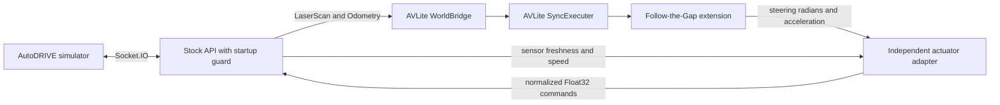

# AVLite on AutoDRIVE

## What runs

This integration uses [AV-Lab/avlite](https://github.com/AV-Lab/avlite) at commit
`1653f592b2eb5289a14c0d1041e50fdea855322a` (package version 0.6.3).
`SyncExecuter` invokes the real AVLite Follow-the-Gap controller, including its
Pure Pursuit steering and velocity PID, against a ROS-backed `WorldBridge`.
The simulator supplies ground-truth localization; mapping, SLAM, global planning,
and AVLite's dashboard are not enabled for this initial reactive driving setup.



The four services in `docker-compose.avlite.yml` are a standalone workflow.
Do not combine it with the original Compose file. Both controllers share the
same actuator topics and only one may run at a time.

## Setup and running

Use Linux with Docker Compose v2, the NVIDIA Container Toolkit, the two AutoDRIVE
`2026-icra-practice` images, and an X11 display. Unity Hub and a Unity Editor
license are not needed to run the prebuilt simulator. Internet access is required
for the first build. Run from the repository root:

```bash
docker compose down
xhost +si:localuser:root
docker compose -f docker-compose.avlite.yml build
docker compose -f docker-compose.avlite.yml up -d
docker compose -f docker-compose.avlite.yml logs -f avlite actuator
```

The batch-mode simulator connects automatically to port 4567. `Sensors ready`
and adapter `active` indicate that commands can flow. The simulator uses GPU
rendering even though it runs in batch mode. A startup packet can lack LiDAR;
the small API wrapper replies with zero commands until all required fields exist,
then delegates to the unmodified stock API. No synthetic sensor values are sent.

The source package and YAML configuration are mounted read-only into containers.
After editing code or configuration, restart the affected services. Restart AVLite
after changing its profile, and the adapter after changing actuator gains.
Restart both after editing the shared `config/driving.yaml` file.
Rebuild when changing the Dockerfile or dependencies.

## Topics, frames and units

| Interface | Meaning |
| --- | --- |
| `/autodrive/roboracer_1/lidar` | ROS `LaserScan`; 270-degree scan, nominal 1,080 beams |
| `/autodrive/roboracer_1/odom` | Ground-truth world pose and body-frame longitudinal velocity |
| `/avlite/control_command` | `AckermannDriveStamped`; steering in radians, acceleration in m/s²; `speed` is unused |
| `/autodrive/roboracer_1/throttle_command` | Forward normalized `Float32`, constrained to `[0, max_throttle]` from `config/driving.yaml` |
| `/autodrive/roboracer_1/steering_command` | Normalized `Float32` in `[-1, 1]`, positive left |
| `/autodrive/reset_command` | `Bool`; clears controller readiness and actuator integrators |
| `.../lap_count`, `.../collision_count` | Simulator counters used to validate a run |

The vehicle origin is the rear axle. Wheelbase is 0.324 m. LiDAR is mounted at
`[0.2733, 0, 0.096]` m in the vehicle frame, with identity rotation. Scan points
use x forward and y left; AVLite applies the mounting transform exactly once.
Odometry twist is already in vehicle coordinates, so velocity is **not** rotated
by the world yaw. Steering normalization divides by 30 degrees in radians.

Positive infinite ranges become maximum-range returns. Invalid or below-minimum
ranges become near returns rather than clear space. A scan needs at least 50%
valid finite returns to permit driving. Missing, invalid or stale scans stop
command generation. This conservative policy may stop on unusually open scenes.

AVLite's upstream gap finder examines gaps between point bearings. This repository
extends it to find a clear vehicle-width corridor in a dense angular scan. The
extension selects a range-based target, smooths within the selected opening,
reduces speed in turns, and requests deceleration when no opening is available.
The upstream controller still computes the steering angle and acceleration.

## Actuator conversion and stopping

`config/driving.yaml` is the shared source for `speed_mps` and `max_throttle`.
The AVLite and actuator profiles use `shared_settings: driving.yaml` with
`${speed_mps}` / `${max_throttle}` references. Paths are relative to each profile,
and the launchers resolve the references to numbers before starting either node.
Speed must be finite and positive; throttle must be finite and in `(0, 1]`.
Missing files, unknown references, and invalid shared settings fail startup.

`config/avlite.yaml` contains the remaining small-car AVLite settings.
`config/actuator.yaml` contains the remaining adapter limits and speed gains.
Load the latter with `python3 -m avlite_autodrive.adapter --config /config/actuator.yaml`;
ROS's raw `--params-file` parser does not resolve these references. Plain numeric
ROS parameter files and `--ros-args` overrides remain supported.

The adapter integrates AVLite acceleration into a speed demand, capped by the
shared `speed_mps`, then tracks it with feedforward plus PI speed feedback. Acceleration is
never interpreted directly as normalized throttle. Gains were calibrated against
the practice simulator; do not assume they apply to a real car or another model.
The recorded clean-lap validation used 0.5 m/s and a 0.02 throttle cap; changes to
the shared settings do not extend those measured results to higher speeds.

The adapter runs at 20 Hz and requires commands, odometry and scans less than
0.5 seconds old. It rejects non-finite commands, stale command timestamps and
invalid odometry; resets on pose jumps; and commands zero if another publisher
appears on either actuator topic. Shut down the competing controller: publishing
zero cannot reliably override a second publisher that continues sending motion.

```bash
# Stop commands, let the independent watchdog send zero, then stop everything.
docker compose -f docker-compose.avlite.yml stop avlite
sleep 1
docker compose -f docker-compose.avlite.yml down
```

The adapter also publishes zero during graceful SIGINT/SIGTERM shutdown. Killing
the adapter or losing the ROS/API connection is outside its watchdog protection:
the stock API can retain its last command. Zero throttle is a braking request in
this simulator, not an instantaneous stop guarantee. This is a simulator setup,
not a validated hardware control system.

To switch back, stop the AVLite workflow, then run `docker compose up` and follow
the original simulator GUI instructions in the README.

## Recording a lap

On Windows, use `./record-windows.ps1 -Seconds 120 -Label corner-test` while the
simulator and controllers are running. It saves a dated folder in `log/recordings/`
with a PNG graph, CSV, raw JSONL, summary, configuration snapshots, and controller
logs. The recording is passive and leaves the simulation running afterward.
Reload edited configuration before capturing; snapshots describe files on disk.
Wait for simulator/controller startup or restart to finish before recording.
The recorder waits up to 30 seconds for valid odometry before starting the requested
duration (`-WaitForOdomSeconds` on Windows, `--wait-for-odom` in Python). A 10-second
loss of valid odometry ends capture with an error and preserves partial JSONL and
the summary. Replacing the bridge leaves an existing recorder on the old network
connection; start a new recording after the restart. A stationary car still sends
odometry and can be recorded normally.

Start the simulator, API and adapter without AVLite. If necessary restart the
simulator while AVLite is stopped to begin from the initial position:

```bash
docker compose -f docker-compose.avlite.yml up -d bridge simulator actuator
mkdir -p log/avlite
docker compose -f docker-compose.avlite.yml run --rm --no-deps \
  -v "$PWD/log/avlite:/records" --entrypoint /bin/bash actuator \
  -c 'source /opt/ros/humble/setup.bash && python3 -m avlite_autodrive.record --seconds 600 --stop-after-lap --output /records/lap.jsonl'
```

While the recorder runs, use a second terminal to start driving:

```bash
docker compose -f docker-compose.avlite.yml up -d avlite
```

The recorder writes JSONL telemetry and `lap.summary.json`. It observes only:
`--stop-after-lap` stops **recording**, not the car. Stop AVLite afterward with the
command above. `clean_lap` requires a lap-counter increase, unchanged collision
counter and no observed reset. Start recording before driving from the initial
position so the record covers the full lap. Logs are ignored by Git.

To graph an existing JSONL recording on Linux:

```bash
docker compose -f docker-compose.avlite.yml run --rm --no-deps \
  -v "$PWD/log/avlite:/records" --entrypoint /bin/bash avlite \
  -c 'python -m avlite_autodrive.plot_recording /records/lap.jsonl'
```

This writes `lap.csv` and `lap.png` alongside the original file. Current recordings
include UTC timestamps and the age of received messages; readings older than
0.5 seconds appear as gaps in plots. Older recordings without age fields can
still be graphed, but their freshness cannot be checked.

## Repeatable tests

```bash
# Genuine upstream AVLite + ROS subprocess integration, isolated from the car.
docker compose -f docker-compose.avlite.yml run --rm --no-deps \
  -e ROS_DOMAIN_ID=73 -e RUN_ROS_TESTS=1 --entrypoint /bin/bash avlite \
  -c 'source /opt/ros/humble/setup.bash && python -m pytest -q -p no:cacheprovider test'

# ROS package build, using the NumPy 1 runtime.
docker compose -f docker-compose.avlite.yml run --rm --no-deps \
  --entrypoint /bin/bash actuator \
  -c 'source /opt/ros/humble/setup.bash && cd /tmp && colcon build --base-paths /opt/integration --packages-select avlite_autodrive'

# Original controller regression tests (with NumPy and pytest installed).
PYTHONPATH=src/my_team_racer python3 -m pytest -q src/my_team_racer/test/test_racer_node.py
```

ROS domain 73 must be unused by other applications during the test. The test
starts the actual runner and adapter, supplies synthetic ROS sensors, checks
startup gating and motion commands, kills AVLite, and verifies zero output.
It does not require a GPU or a running simulator.

The AVLite container has NumPy 2 in its virtual environment. The stock API and
adapter retain the original NumPy 1 environment to avoid breaking `cv_bridge`.
AVLite's Git revision and Python dependency constraints are recorded in the
Dockerfile and `docker/avlite-constraints.txt`. The complete installed dependency
list is available at `/opt/avlite-dependencies.txt` in the AVLite image.

## Troubleshooting

- No sensor data: inspect `docker compose -f docker-compose.avlite.yml logs bridge simulator`.
  Check port 4567, Docker GPU access and X11 authorization.
- `Authorization required` from Unity: run `xhost +si:localuser:root` in the local
  desktop session, then restart the simulator. Remove the grant afterward with
  `xhost -si:localuser:root` if no other root container needs it.
- Stale-sensor warnings: inspect actual topic rates and bridge errors. Do not
  increase the watchdog timeout simply to suppress a data-flow problem.
- An orphan-container warning can refer to the stopped original `devkit` service.
  Check `docker ps`; the old racer must not be running.
