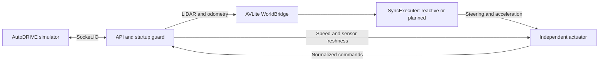

# Setup, control and telemetry

## What runs and where to edit

This repository pins AVLite 0.6.3 at
`1653f592b2eb5289a14c0d1041e50fdea855322a`. The simulator supplies ground-truth
pose. `SyncExecuter` runs either our Follow the Gap extension or
[planned driving](planned-driving.md). Estimated localization, occupancy mapping
and the AVLite dashboard are not enabled in this simulator workflow.


```mermaid
flowchart LR
  Sim[AutoDRIVE simulator] <-->|Socket.IO| API[API and startup guard]
  API -->|LiDAR and odometry| World[AVLite WorldBridge]
  World --> Stack[SyncExecuter: reactive or planned]
  Stack -->|Steering and acceleration| Actuator[Independent actuator]
  API -->|Speed and sensor freshness| Actuator
  Actuator -->|Normalized commands| API
```

| Location | Purpose |
| --- | --- |
| [plugin/](../src/avlite_autodrive/avlite_autodrive/plugin) | Our AVLite bridge, controller and planner extensions |
| [runner.py](../src/avlite_autodrive/avlite_autodrive/runner.py) | Assemble and start the stack |
| [actuation.py](../src/avlite_autodrive/avlite_autodrive/actuation.py), [adapter.py](../src/avlite_autodrive/avlite_autodrive/adapter.py) | Actuator conversion and ROS process |
| [config/](../config) | Shared driving settings, AVLite profile and actuator gains |
| `/opt/avlite-venv/lib/python3.10/site-packages/avlite/` | Upstream AVLite source inside the built container |

Upstream AVLite is installed by [Dockerfile.avlite](../docker/Dockerfile.avlite).
The image records dependencies at `/opt/avlite-dependencies.txt` and uses
[pinned constraints](../docker/avlite-constraints.txt). AVLite uses NumPy 2; the
stock API and actuator retain NumPy 1 for `cv_bridge`.

## Start, reload and stop

Windows: follow the [README quick start](../README.md#start-and-record-on-windows).
The visible simulator is a native Windows Unity application; Docker runs the
ROS bridge and controllers. Initial downloads can take several minutes.

Linux requires Docker Compose v2, NVIDIA Container Toolkit and an X11 display.
Run from the repository root:

```bash
docker compose down
xhost +si:localuser:root
docker compose -f docker-compose.avlite.yml build
docker compose -f docker-compose.avlite.yml up -d
docker compose -f docker-compose.avlite.yml logs -f avlite actuator
```

The Linux simulator uses GPU rendering in batch mode and connects automatically
to port 4567. No Unity Editor is required. The API startup guard replies with
zero controls to incomplete packets until real sensors arrive.

Code/configuration are mounted read-only into containers. Restart the affected
service after edits; restart both controllers for shared-setting changes.
Rebuild for Dockerfile/dependency changes. On Windows:

```powershell
docker compose -f docker-compose.avlite.yml -f docker-compose.windows.yml restart avlite actuator
```

Restarting permits driving once sensors are ready. The recording wrapper handles
this reload itself. Only one controller may own the actuator topics; keep the
original controller stopped when using AVLite.

Stop Windows with `.\run-windows.ps1 -Stop`. On Linux, stop AVLite first so
the actuator can transmit zero before shutdown:

```bash
docker compose -f docker-compose.avlite.yml stop avlite
sleep 1
docker compose -f docker-compose.avlite.yml down
```

## Topics, frames and units

| Interface | Meaning |
| --- | --- |
| `/autodrive/roboracer_1/lidar` | `LaserScan`; 270°, nominally 1,080 beams |
| `/autodrive/roboracer_1/odom` | World pose; body-frame longitudinal velocity |
| `/avlite/control_command` | `AckermannDriveStamped`; steering radians, acceleration m/s²; `speed` unused |
| `/avlite/controller_diagnostics` | JSON target speed, preview, clearance, saturation and timing |
| `/avlite/actuator_diagnostics` | JSON demand, throttle/braking state and freshness |
| `/autodrive/roboracer_1/throttle_command` | `Float32` in `[0, max_throttle]` |
| `/autodrive/roboracer_1/steering_command` | `Float32` in `[-1, 1]`; positive left |
| `/autodrive/reset_command` | `Bool`; clears readiness and accumulated control state |
| `lap_count`, `collision_count` under `/autodrive/roboracer_1/` | Screening counters |

The vehicle frame originates at the rear axle: x forward, y left. Wheelbase
$\ell=0.324$ m; LiDAR mount is $(0.2733,0,0.096)$ m with identity rotation.
Apply that transform once. Odometry velocity is already in the vehicle frame.

Positive infinite ranges represent no return. Invalid/below-minimum ranges become
near obstacles. At least 50% of scan ranges must be valid finite returns to permit
driving; unusually open scenes may fail that check.

<a id="corner-entry-screening-candidate"></a>

## Corner preview and steering

For Follow the Gap, steering lookahead and preferred gap-search preview are:

$$
L=\mathrm{clip}(k_vv,L_{\min},L_{\max}),\qquad
L_p=\min(L_{\max},\max(L,L_{\mathrm{gap}})).
$$

Here $\mathrm{clip}(z,l,h)=\min(h,\max(l,z))$ keeps a value within its bounds.
Current parameters are $k_v=0.4$ s, $L_{\min}=0.6$ m, $L_{\max}=1.8$ m and
$L_{\mathrm{gap}}=1.5$ m. If no opening fits, the search tries shorter distances;
the pursuit distance shrinks when needed. Removing `racing.gap_preview_min_m`
restores the earlier coupled preview/steering behavior.

For a selected pursuit target $(g_x,g_y)$ in the vehicle frame, Pure Pursuit uses:

$$
\kappa=\frac{2g_y}{g_x^2+g_y^2},\qquad
\delta=\arctan(\ell\kappa),\qquad
u_\delta=\mathrm{clip}\left(\frac{\delta}{\pi/6},-1,1\right).
$$

$\kappa$ is curvature in m⁻¹, $\delta$ is wheel angle in radians and $u_\delta$
is normalized steering. Gap bearing describes the target direction, not wheel angle.

Speed is limited by curvature and available clearance:

$$
v_{\mathrm{corner}}\leq\sqrt{\frac{a_{\mathrm{lat}}}{|\kappa|}},\qquad
d_{\mathrm{stop}}=v\tau+\frac{v^2}{2b}.
$$

The reactive speed cap uses the larger absolute curvature from raw and smoothed
target bearings. For zero curvature, use the configured speed ceiling. Initial assumptions are
$a_{\mathrm{lat}}=3.0$ m/s², deceleration $b=1.5$ m/s², reaction time $\tau=0.25$ s
and clearance margin 0.15 m. These remain uncalibrated. Reactive clearance checks
use straight heading/target corridors; [planned mode](planned-driving.md#speed-and-obstacle-limits)
also checks curved paths. See the [preview results](../README.md#tests-and-improvements).

## Actuator conversion and stopping

`config/driving.yaml` supplies shared `speed_mps` and `max_throttle`.
The launchers resolve profile references at startup; missing/invalid values fail
startup. Use the adapter's `--config` loader, not ROS `--params-file`, for shared
references.

During ordinary acceleration, speed demand $v_d$ and normalized throttle $u$ follow:

$$
v_d[k+1]=\mathrm{clip}(v_d[k]+a_{\mathrm{cmd}}\Delta t,0,v_{\max}),
$$

$$
u=\mathrm{clip}(k_{\mathrm{ff}}v_d+k_pe+k_iI_c,0,u_{\max}),\qquad e=v_d-v.
$$

$I_c$ is the bounded candidate integral of speed error; it is retained only when
raw throttle is within its bounds. Defaults are $k_{\mathrm{ff}}=0.04$,
$k_p=0.01$, $k_i=0.002$, tuned in the simulator.

For $a_{\mathrm{cmd}}\leq-0.1$ m/s², forward throttle becomes zero, the integral
clears and demand is reconciled to measured speed. This override does not
guarantee the requested physical deceleration.

The adapter runs at 20 Hz on a steady clock. Commands, odometry and scans must
be fresher than 0.5 s. Invalid inputs, pose jumps and competing actuator publishers
trigger zero output/reset handling. Shut down a competing publisher; publishing
zero cannot override its continued motion commands.

The watchdog requires the adapter and API connection to remain alive. If the
adapter dies, the stock bridge can retain its last command; independent bridge
command expiry is pending. Graceful shutdown sends zero, not an instantaneous stop.

## Recording a lap

With the Windows simulator connected in Autonomous mode:

```powershell
.\record-one-lap.ps1 -Laps 3 -Label controller-test
```

The wrapper stops AVLite, reloads the actuator and prompts for a reset. After
Enter, it records fresh stationary odometry/counters before starting AVLite.
It stops driving on the requested lap count plus a one-second collision-feedback
window, an incident or timeout. Failure/Ctrl+C also stops AVLite.

Defaults: `-Laps 1`, `-MaxSeconds 600`, `-WaitForOdomSeconds 30`.
Use `-NoOpen` to skip opening the graph or `-NoTrackMap` to skip the LiDAR outline.
Reset before capture; starting mid-lap or resetting during capture invalidates
a full clean-lap claim. A 10-second loss of valid odometry aborts recording.
Finish service restarts before capture; replacing the bridge requires a new recorder.

| Saved file | Purpose |
| --- | --- |
| `telemetry.jsonl` / `telemetry.csv` | Sampled signals with elapsed/UTC times; CSV for analysis |
| `telemetry.summary.json` | Clean-run status, counters and lap statistics |
| `telemetry.lap.png` | Measured path, observed track and speed |
| `telemetry.control.png` | Targets vs feedback, steering, throttle, preview, clearance and timing |
| `telemetry.png` | General signal and event plots |
| `telemetry.track.json` | Optional accumulated LiDAR outline |
| `config/` and controller logs | Disk settings and run diagnostics |

Planned mode adds [runtime map/profile artifacts](planned-driving.md#recording-and-rollback).
Disk snapshots are distinct from active per-tick demands. The graph's saved speed
ceiling is also distinct from controller target and measured speed.

For passive capture, use `.\record-windows.ps1 -Seconds 120 -Label corner-test`.
It leaves driving running afterward. Its `-Laps`, `-StopAfterLap` and
`-StopOnIncident` options stop capture only.

Capture is approximately 10 Hz, not full sensor replay. Measured acceleration
uses $a_i=(v_i-v_{i-1})/(t_i-t_{i-1})$, excluding stale/incident jumps. Short
transients can be missed; stale signals appear as graph gaps.

### Lap timing

For $N\geq2$ consecutive observed finish crossings at elapsed times $t_1,\ldots,t_N$:

$$
T_i=t_{i+1}-t_i,\quad M=N-1,\quad
\bar T=\frac{1}{M}\sum_{i=1}^{M}T_i,\quad
\sigma_T=\sqrt{\frac{1}{M}\sum_{i=1}^{M}(T_i-\bar T)^2}.
$$

Three crossings give two rolling lap times. `lap_times_s` stores these intervals;
`first_lap_driving_s` separately measures first motion to first crossing.
Neither includes startup waiting or the finish-feedback tail. The simulator's
timer is retained separately and may include waiting.

`clean_run` additionally requires fresh, consecutive counter evidence, no
collisions/resets and completion of the target's feedback window.
A lap-counter increase alone is insufficient.

### Linux recording and plotting

With AVLite stopped and the simulator, bridge and actuator running from a reset:

```bash
mkdir -p log/avlite
docker compose -f docker-compose.avlite.yml run --rm --no-deps \
  -v "$PWD/log/avlite:/records" --entrypoint /bin/bash actuator \
  -c 'source /opt/ros/humble/setup.bash && python3 -m avlite_autodrive.record --seconds 600 --stop-after-lap --output /records/lap.jsonl'
```

In a second terminal, start `docker compose -f docker-compose.avlite.yml up -d avlite`.
This recorder observes only: **stop AVLite yourself afterward**.
To plot the saved data:

```bash
docker compose -f docker-compose.avlite.yml run --rm --no-deps \
  -v "$PWD/log/avlite:/records" --entrypoint /bin/bash avlite \
  -c 'python -m avlite_autodrive.plot_recording /records/lap.jsonl --lap-report'
```

## Track outline on the path graphs

Windows recording captures LiDAR hits by default. In 2D, each hit is placed by:

$$
p_{\mathrm{world}}=R(\psi)\bigl(R_{\mathrm{mount}}p_{\mathrm{lidar}}
+t_{\mathrm{mount}}\bigr)+\begin{bmatrix}x\\y\end{bmatrix}.
$$

$(x,y,\psi)$ is simulator pose. The recorder pairs scan/odometry stamps within
20 ms, rejects stale/mismatched frames, excludes invalid/no-return hits and
deduplicates points at 3 cm. Capture is limited to 10 Hz with no per-beam motion
correction, so turns can blur the outline. Event markers are approximate locations.

Gray points are observed surfaces. Blank space is unknown, not proven free.
This ground-truth outline is not an occupancy map or localization system.
A trajectory without saved scans cannot reconstruct track boundaries.

The plotter automatically reads the sibling `.track.json`. To reuse an outline,
add `--track-map /records/reference.track.json` to the plotting command. Both
runs must share the same layout and world frame; no automatic alignment occurs.

## Repeatable tests

Linux commands below match the repository's test workflow. ROS domain 73 must be
unused by the car and other applications. No simulator/GPU is needed.

```bash
docker compose -f docker-compose.avlite.yml run --rm --no-deps \
  -e ROS_DOMAIN_ID=73 -e RUN_ROS_TESTS=1 --entrypoint /bin/bash avlite \
  -c 'source /opt/ros/humble/setup.bash && python -m pytest -q -p no:cacheprovider test'

docker compose -f docker-compose.avlite.yml run --rm --no-deps \
  --entrypoint /bin/bash actuator \
  -c 'source /opt/ros/humble/setup.bash && cd /tmp && colcon build --base-paths /opt/integration --packages-select avlite_autodrive'

PYTHONPATH=src/my_team_racer python3 -m pytest -q src/my_team_racer/test/test_racer_node.py
```

The ROS tests exercise the actual executor/adapter with synthetic inputs and
verify zero output after controller loss. They do not establish lap performance.

Windows response workflow cleanup can be checked without Docker or the simulator:

```powershell
powershell -NoProfile -ExecutionPolicy Bypass -File tests/test-response-workflow.ps1
```

The test mocks Docker and covers normal completion, partial controller startup,
recorder failure and controller exit. See [response measurements](response-measurements.md)
for source-rate capture, qualification and the live test command.

## Original controller

The legacy [racer_node.py](../src/my_team_racer/my_team_racer/racer_node.py) estimates
a centerline from left/right LiDAR walls and uses geometric Pure Pursuit.
On Linux, stop AVLite, grant X11 access as above and run
`docker compose up simulator devkit`. Select Connection and Autonomous in Unity.

For an interactive development shell:

```bash
docker compose -f docker-compose.yml -f docker-compose.dev.yml run --rm devkit
# Inside the container:
colcon build --packages-select my_team_racer
source install/setup.bash
ros2 launch my_team_racer racer.launch.py
```

Host `src/` is mounted at `/home/autodrive_devkit/src/my_packages`.

## Troubleshooting

| Symptom | Check |
| --- | --- |
| Download progress but no Windows window yet | Wait for download/extraction; files are under `log/windows/` |
| No sensors | Connection/Autonomous, port 4567 and bridge logs; Linux also needs GPU/X11 |
| Unity reports `Authorization required` on Linux | Run `xhost +si:localuser:root` in the desktop session, then restart the simulator |
| Stale-sensor warnings | Topic rates and bridge errors; preserve watchdog thresholds |
| Competing publisher or old `devkit` container | Stop the original racer before starting AVLite |

Remove the Linux X11 grant with `xhost -si:localuser:root` when no longer needed.
