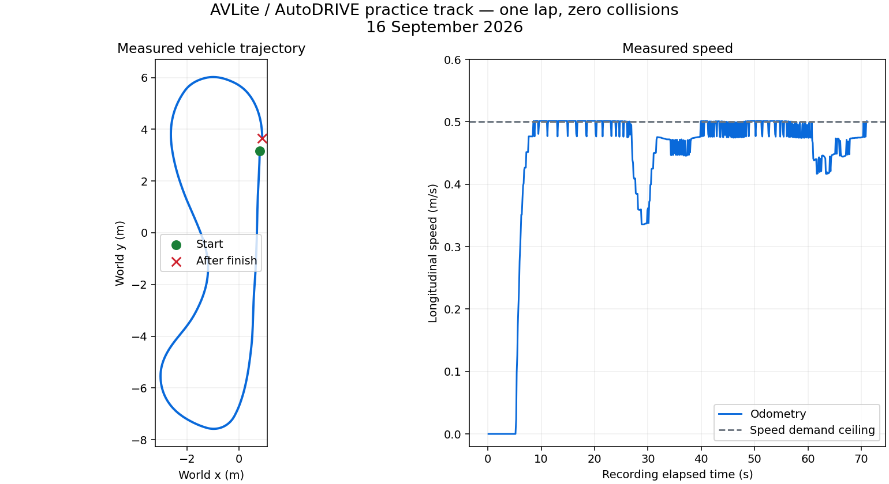

# AVLite validation — 16 September 2026

## Result

**AVLite controlled the actual AutoDRIVE GPU simulator through a complete clean
lap.** A second run from a fresh simulator startup reproduced the result with
the final code and configuration. No manual steering, reset, or collision occurred
during the recorded final lap. The simulator was stopped after validation.

Evidence: [recorded summary](validation/avlite-lap.summary.json) and
[sampled telemetry CSV](validation/avlite-lap.csv). The summary uses every received
odometry sample; the CSV/plot use approximately 10 Hz samples, so their final
distance can differ slightly from the summary.

## Final fresh-start run

| Measurement | Observed |
| --- | --- |
| Lap count | 0 → 1 |
| Collision count | 0 → 0 |
| Observed resets / position jumps | 0 |
| Distance through the recording | 31.0415 m |
| Maximum measured speed | 0.5017 m/s |
| AVLite cruise speed / adapter speed-demand ceiling | 0.5 m/s |
| Peak sampled normalized throttle command | 0.01991 (configured ceiling 0.02) |
| Peak sampled AVLite steering magnitude | 0.37183 rad (21.30°) |
| Recording duration | 71.107 s |
| First motion → first observed lap increment | approximately 64.707 s |
| Simulator-reported last lap time | 91.779 s, including waiting before driving |

The first motion sample was at recording time 5.400 s; the first sampled lap
increment was at 70.107 s. The recorder continues for one second after the
increment to allow collision feedback from the finish frame to arrive. The
simulator timer includes startup waiting and is not a driving-only benchmark.

The earlier recorded clean lap also passed: 31.0489 m, lap 0 → 1, no collisions,
no resets, and maximum speed 0.5032 m/s. That recording included startup debugging
before the first motion; the fresh-start run above verifies the final setup.

## Environment and implementation

- Host: Ubuntu 24.04; NVIDIA GeForce RTX 5070 Ti; driver 595.91.07.
- Runtime: ROS 2 Humble, Python 3.10.12, Docker Compose, host networking and IPC.
- Simulator/API: `autodriveecosystem/autodrive_roboracer_{sim,api}:2026-icra-practice`.
- AVLite: version 0.6.3, Git revision
  `1653f592b2eb5289a14c0d1041e50fdea855322a`.
- AVLite NumPy 2.2.6 in its own environment; original API NumPy 1.22.2 retained.
- Genuine AVLite `SyncExecuter`, `FollowTheGapController` extension and ROS
  `WorldBridge`; simulator ground-truth pose and LiDAR, with no global planner.
- Measured odometry delivery approximately 22 Hz; control and adapter timers 20 Hz.

The wheelbase (0.324 m), steering normalization (30°), body-frame velocity, and
LiDAR mount were checked against the simulator vehicle configuration/scripts and
API transform code. Live steering feedback and the completed track run verified
the sign and practical behavior of the conversion.

## Automated validation

| Check | Result |
| --- | --- |
| New AVLite package tests in final built image, without source bind mount | **23 passed** |
| Original controller regression tests | **9 passed** |
| Host-only actuation, sensors and startup-guard subset | **16 passed**, included in the 23 above |
| ROS Humble `colcon build --packages-select avlite_autodrive` | Passed |
| Final Docker Compose image build with pinned AVLite/dependency constraints | Passed |
| Python lint for integration package and original controller | Passed |
| `git diff --check` | Passed |

The ROS integration test launches the actual AVLite runner and independent
adapter in an isolated ROS domain, publishes synthetic LaserScan/Odometry, checks
zero output before AVLite starts, observes nonzero throttle through the real
AVLite stack, kills AVLite with SIGKILL, and checks that later throttle outputs
are zero while the adapter remains alive. Other tests cover scan conversion,
LiDAR transform, body velocity, turn direction, blocked paths, saturation,
invalid inputs, stale-data gating, integrator reset and incomplete startup packets.

The original suite had three failures because its helper called an obsolete
steering signature. The helper now estimates the target before calling the
current `(gx, gy)` method. The original controller received formatting changes
only; its driving behavior was not changed.

CI now includes the new unit tests, real AVLite/ROS process test and ROS package
build. These jobs require no GPU. See [repeatable test commands](avlite-setup.md#repeatable-tests).

## Findings resolved during live testing

1. **Container build tooling:** the base image's old packaging tools could not
   build current AVLite metadata. The AVLite environment now pins compatible
   pip, setuptools, wheel and packaging versions, plus tested dependency constraints.
2. **Unity startup handshake:** the initial packet can omit LiDAR. The stock API
   raises a `KeyError`, leaving Unity waiting for a reply. The wrapper now replies
   with zero controls to incomplete packets and delegates complete packets to the
   stock API. The final fresh-start run connected without intervention.
3. **Throttle calibration:** initial gains produced oscillations and a measured
   1.2274 m/s peak despite a 0.5 m/s demand. Reducing proportional/integral gains,
   calibrating feedforward and capping throttle at 0.02 removed that overshoot in
   the final run. A demand ceiling alone is not a physical speed guarantee.
4. **Stopping:** live telemetry after stopping AVLite confirmed throttle command,
   throttle feedback and speed all returned to zero before container shutdown.

## Scope and remaining work

This validates a conservative simulator baseline on the supplied practice track.
It does not establish robustness on other tracks, obstacle layouts, higher speeds,
different physics or physical hardware. Localization uses simulator ground truth;
SLAM, planning, dashboard integration and competition-speed tuning remain future
work. The watchdog depends on the adapter and simulator API remaining alive.

Raw development recordings remain locally in ignored `log/avlite/`. The final
summary, sampled telemetry and figure above are committed for review.
