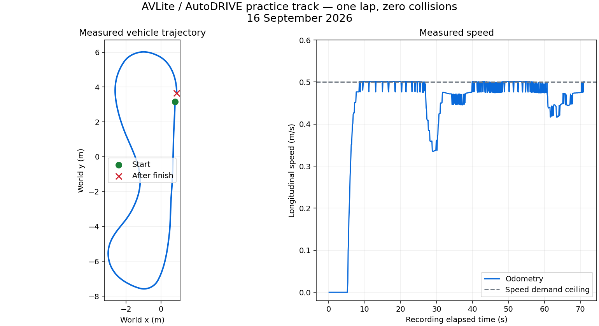

# Initial clean-lap validation — 16 September 2026

AVLite completed a clean lap in the AutoDRIVE GPU simulator. A fresh-start repeat
confirmed the final low-speed setup without collisions, resets or manual steering.
This is historical baseline evidence; use the [checklist](checklist-2026-09-21.md)
for current progress.

Evidence: [summary](validation/avlite-lap.summary.json) and
[sampled CSV](validation/avlite-lap.csv). The summary uses every received odometry
sample; the approximately 10 Hz CSV/plot can differ slightly in integrated distance.

## Fresh-start result

| Measurement | Observed |
| --- | --- |
| Lap count; collisions / resets | 0 → 1; 0 / 0 |
| Recording distance | 31.0415 m |
| Requested / peak measured speed | 0.5 / 0.5017 m/s |
| Throttle cap / sampled peak | 0.02 / 0.01991 |
| Peak sampled steering magnitude | 0.37183 rad (21.30°) |
| Recording duration | 71.107 s |
| First motion → first finish crossing | Approximately 64.707 s |
| Simulator-reported lap time | 91.779 s, including pre-drive waiting |

First motion was at 5.400 s and the sampled crossing at 70.107 s:

$$
T_{\mathrm{first\ driving}}=70.107-5.400=64.707\ \mathrm{s}.
$$

The recording includes a one-second finish-feedback tail. This first driving
interval is separate from [rolling lap timing](avlite-setup.md#lap-timing).
An earlier run also passed: 31.0489 m, no incidents and 0.5032 m/s peak.

## Environment and checks

| Component | Validated baseline |
| --- | --- |
| Host | Ubuntu 24.04; RTX 5070 Ti; NVIDIA driver 595.91.07 |
| Runtime | ROS 2 Humble, Python 3.10.12, Docker Compose; host network/IPC |
| Simulator/API | AutoDRIVE `2026-icra-practice` images |
| AVLite | 0.6.3, revision `1653f592b2eb5289a14c0d1041e50fdea855322a` |
| NumPy | AVLite 2.2.6 in its venv; stock API 1.22.2 |
| Control | SyncExecuter, Follow the Gap extension, ROS WorldBridge; ground-truth pose |
| Observed rates | Odometry approximately 22 Hz; controller/actuator 20 Hz |

Wheelbase, 30° steering normalization, body-frame velocity and LiDAR mount were
checked against simulator/API code. Live steering feedback and the completed
lap confirmed sign/conversion behavior.

At this milestone, the integration suite passed **23 tests**, including a real
ROS process test, and the original controller suite passed **9**. Container/ROS
builds, lint and whitespace checks passed. These are historical counts.
The process test killed AVLite and confirmed later zero outputs while the
independent adapter stayed alive. See [test commands](avlite-setup.md#repeatable-tests).

## Findings and limits

| Issue | Resolution |
| --- | --- |
| Base packaging tools could not build AVLite | Pin compatible build tools and dependencies in its venv |
| Initial Unity packets sometimes lacked LiDAR | Reply with zero controls until a complete packet arrives |
| Initial speed gains overshot 0.5 m/s to 1.2274 m/s | Reduce PI gains, tune feedforward and cap throttle at 0.02 |
| Stopping behavior | Observe throttle command/feedback and speed return to zero before shutdown |

This establishes a conservative baseline on one track, not higher-speed or
hardware acceptance. The adapter watchdog requires the adapter/API to stay alive.
Planned driving was added later; estimated localization and hardware validation
remain separate work.

Raw development logs are ignored under `log/avlite/`. The final graph, summary
and sampled telemetry are committed above.
