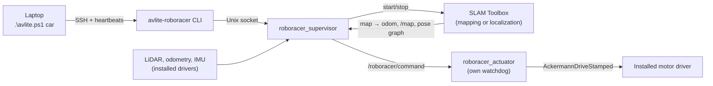

# Jetson car: map one lap, then race on command

Implements [plans/LOCALIZATIONPLAN.md](plans/LOCALIZATIONPLAN.md) in
`src/avlite_roboracer`. **Status (4 October 2026): software only.** The
hardware-independent parts are covered by automated tests. None of it has run on the
Jetson, against real sensors, or with SLAM Toolbox yet. The hardware profile is
deliberately unfilled. Until it is filled from measurements, the supervisor and
actuator refuse to command motion.

## Checklist to get it running

Work through these in order. Nothing autonomous moves until step 3 is done.

- [ ] **1. Inspect the Jetson** — run `bash tools/inspect-jetson.sh` and copy the reported frame/topic names into `config/roboracer/hardware.yaml`. Leave all measurement fields `null`.
- [ ] **2. Record and verify sensors** — drive a slow manual teleop lap, `recorder record`, `recorder export`, then `report`. Resolve every `fail` before continuing.
- [ ] **3. Commission the hardware** — record stop tests, run `commissioning.py`, and fill the measured values (`localization.*`, `limits.*`, `vehicle.*`, `mounts.laser`) into `hardware.yaml`. This is the gate that unblocks autonomous motion.
- [ ] **4. Validate mapping + localization offline** — replay two separate manual recordings through SLAM Toolbox (map on one, localize on the other) and run the localization report with `--require-map-frame`. Check that every threshold passes.
- [ ] **5. Install the Jetson runtime** — install ROS 2, SLAM Toolbox and the pinned AVLite revision for the JetPack version found in step 1. The desktop Docker image is not the deployment image.
- [ ] **6. Stationary hardware tests** — motors disabled or wheels clear: steering direction, actuator bounds, manual override, process failure, connection loss. None may cause movement.
- [ ] **7. First autonomous mapping lap** — `ros2 launch avlite_roboracer roboracer.launch.py`, then `.\avlite.ps1 car -Action map-start` from the laptop. Verify the car stops near the start, map is accepted, and state reaches `READY`.
- [ ] **8. Track acceptance** — `race-start`, several localized laps, verified `stop`. Record scan alignment, localization error and stop response. Raise speed only after thresholds are established.

Still unverified on real hardware (watch for these in steps 4–7):
- SLAM Toolbox service, topic and parameter names on the installed version
- `ros2 bag record --use-sim-time` support in the installed rosbag2
- Motor driver response to a speed-0 stop command
- AVLite Follow the Gap with the real LiDAR mount

## How it fits together



| Module | Role |
| --- | --- |
| `profile.py`, `config/roboracer/hardware.yaml` | Measured geometry, mounts, steering/motor conversion, limits, localization thresholds. `null` = not measured. |
| `recorder.py` | `ros2 bag` recording with session metadata, export to JSON records, replay through SLAM Toolbox. |
| `recording_check.py`, `quality.py`, `report.py` | Recorded-data checks and the localization-quality report (run without ROS). |
| `commissioning.py` | Command latency, deceleration and stopping distance from a recorded stop test. |
| `command.py`, `actuator_node.py` | Single command owner, command expiry, hardware conversion, manual override. |
| `lap_detector.py` | Mapping-lap completion without simulator counters. |
| `map_builder.py` | RaceMap from the finalized occupancy grid and the corrected pose-graph route. |
| `localization.py`, `readiness.py` | Pose freshness, uncertainty, scan alignment, motion consistency; READY gates. |
| `supervisor.py`, `runtime.py`, `cli.py` | State machine, ROS runtime, operator commands. |

Frames follow REP 105: SLAM Toolbox is the only `map → odom` publisher, the
motor driver publishes `odom → base_link`, and a static publisher provides
`base_link → laser`. `base_link` is the rear-axle centre that AVLite tracks.
Shared map code now takes the map's declared frame (`planning.frame_id`); the
simulator keeps its `world` default.

## 1. First deliverable: profile, recording/replay, localization report

On the Jetson, in the shell where the ROS and vehicle workspace are sourced:

```bash
bash tools/inspect-jetson.sh          # model, JetPack/ROS, topics, USB devices
```

Copy the reported frame and topic names into `config/roboracer/hardware.yaml`.
Leave measurements `null` until they are measured.

Record a slow manual lap. The driver's own teleop drives; nothing is commanded:

```bash
export PYTHONPATH=$HOME/autodrive-roboracer/src/avlite_roboracer:$HOME/autodrive-roboracer/src/avlite_autodrive
P=config/roboracer/hardware.yaml
python3 -m avlite_roboracer.recorder record --profile $P --output log/jetson/manual-1
python3 -m avlite_roboracer.recorder export log/jetson/manual-1 --profile $P
python3 -m avlite_roboracer.report log/jetson/manual-1/records.jsonl --profile $P \
    --output log/jetson/manual-1/report
```

The report checks topic rates and gaps, backwards or repeated stamps, clock
disagreement, transform ownership (one parent per frame, never on both `/tf` and
`/tf_static`), the `odom → base_link → laser` chain, the published LiDAR mount
against the profile, odometry pose versus twist, and IMU versus odometry turn
direction. Resolve every `fail` before autonomous mapping.

Then build a map from one recording and localize a **separate** recording against it:

```bash
python3 -m avlite_roboracer.recorder replay log/jetson/manual-1 --profile $P --mode mapping
python3 -m avlite_roboracer.recorder replay log/jetson/manual-2 --profile $P \
    --mode localization --pose-graph log/jetson/manual-1/replay-mapping-<stamp>/posegraph
python3 -m avlite_roboracer.recorder export log/jetson/manual-2/replay-localization-<stamp> --profile $P
python3 -m avlite_roboracer.report log/jetson/manual-2/replay-localization-<stamp>/records.jsonl \
    --profile $P --require-map-frame \
    --map log/jetson/manual-1/replay-mapping-<stamp>/map.yaml \
    --output log/jetson/manual-2/localization-report
```

Replay uses a separate localhost ROS domain (73 by default; override with
`--domain-id`). It refuses the current shell's live `ROS_DOMAIN_ID` and replays only
scans, odometry, optional IMU and transforms. Recorded driving commands and old SLAM
outputs are excluded. Recorded `map → odom` is dropped from both TF streams, so the
replayed SLAM process is the only publisher. To view replay output, use a separate
terminal with the replay domain and `ROS_LOCALHOST_ONLY=1`.
The localization replay assumes manual-2 starts where manual-1 started;
otherwise pass `--start-pose X Y YAW`. Add `--reference poses.csv` (`t_s,x,y,yaw`)
when an external reference exists; it is used only to measure error. Metrics whose
thresholds are still `null` are reported as `unassessed`, never as passing. Use the
first reports to set `localization.*` from vehicle size and track clearance. Commit
curated results under `docs/validation/`.

## 2. Commissioning before any autonomous motion

1. **Wheels clear:** confirm steering direction (`steering.positive_left`), the
   largest safe angle, the motor ceiling, and the physical emergency stop.
2. **Stops:** record low-speed steps and stops, then analyze them:
   `python3 -m avlite_roboracer.commissioning records.jsonl --output stops.json`.
   Its suggested latency, deceleration, stop-test speed and stopping distance are the
   worst observed cases. Review them before copying them into the profile.
3. Set `limits.mapping_speed_mps` and `limits.racing_speed_mps` (the racing ceiling
   cannot exceed the measured stop-test speed), and `vehicle.*` and `mounts.laser`.
4. **Stationary software tests**, motors disabled or wheels clear: start the stack,
   then check command expiry, `stop`, a killed supervisor, killed SSH, a killed
   actuator, manual override and reconnect. None may cause movement.

Simulator throttle, braking and controller values must not be copied into the profile.

## 3. Running the car

Install the Jetson runtime (ROS 2, SLAM Toolbox, the pinned AVLite revision and this
repository) after the inspection identifies JetPack and ROS versions; the desktop
simulator image is not the deployment image. Then start the stack:

```bash
ros2 launch avlite_roboracer roboracer.launch.py config_dir:=$HOME/autodrive-roboracer/config/roboracer
```

From the laptop (key-based SSH; `-Session` is the value shown by `status`):

```powershell
.\avlite.ps1 car -Action status -JetsonHost racer@jetson.local
.\avlite.ps1 car -Action map-start -JetsonHost racer@jetson.local -Session a1b2c3d4-0
.\avlite.ps1 car -Action race-start -JetsonHost racer@jetson.local -Session a1b2c3d4-1
.\avlite.ps1 car -Action stop -JetsonHost racer@jetson.local
```

| State | Meaning |
| --- | --- |
| `IDLE` | Started; nothing moves. Restarts always begin here. |
| `MAPPING` | Slow Follow the Gap lap while SLAM Toolbox maps. Needs live heartbeats. |
| `FINALIZING` | Stopped: settle loop closure, save pose graph and map, build and validate map and plan, switch to localization. |
| `READY` | Validated plan and stable localization. Waits for `race-start`; never starts itself. |
| `RACING` | Pure Pursuit on the plan with live LiDAR stopping checks. Needs live heartbeats. |
| `STOPPED` | After stop, fault, rejected map or lost laptop. Shows the reasons. |

- `map-start` and `race-start` keep the SSH session open and send a heartbeat every
  0.2 s. Losing heartbeats stops the car after `timing.authorization_timeout_s`.
  Ctrl+C sends `stop`. Losing SSH is not a physical stop, so keep the emergency stop
  ready.
- A premature or unready `race-start` is rejected with the reasons and never queued.
  A duplicate `race-start` is ignored.
- Commands name a session, and sessions include a per-boot id, so a delayed command
  cannot start a later session or one from before a restart. Stop and fault revoke
  the current token; read `status` again before issuing a new start.
- The mapping lap ends only after the car has left the start area, travelled enough by
  odometry, and crossed the start line forwards with matching heading and a matching
  scan. A localization correction that jumps across the line does not count.
- The map is rejected, and the car stays stopped, when the corrected route disagrees
  with the map, a wall is missing for more than 0.5 m, a wall distance jumps
  (ambiguous section), or the track is narrower than the vehicle envelope. Run
  `map-start` again.
- During racing, the supervisor stops on stale sensors, lost or jumping localization,
  leaving the validated corridor, actuator faults, manual override, a SLAM process
  exit or lost authorization. After any stop, racing needs a new `race-start` that
  passes every readiness check.

Each session's pose graph, map, RaceMap, plan and SLAM parameters are stored under
`~/.local/share/avlite-roboracer/sessions/<session>/`.

## Validation still required

The automated tests cover false finish crossings, map rejections, premature and
duplicate starts, stale sessions, single-owner commands, watchdog expiry, recorded-data
checks and the report. They use synthetic data. Still to do, in order:

1. Recorded-data tests on real Jetson recordings, including map reload and
   localization on a separate recording.
2. Stationary hardware tests (steering direction, actuator bounds, manual override,
   process failure, connection loss).
3. Track acceptance: one slow mapping lap, verified stop, READY, explicit race start,
   several localized laps, verified stop.

Not yet verified against real software or hardware:

- SLAM Toolbox service, topic and parameter names on the installed version.
- Pose-graph vertices published on `graph_visualization` (needs
  `enable_interactive_mode: false`).
- `ros2 bag record --use-sim-time` on the installed rosbag2.
- The driver's response to `AckermannDriveStamped` stop commands.
- AVLite Follow the Gap with the real LiDAR mount.

Record localization error (where a reference exists), scan alignment, tracking
clearance, processing latency and stop response. Raise speed only after those
thresholds are established.
