# Jetson: map one lap, then race on command

> **Status, 4 October 2026: software implemented, hardware validation not started.**
> Code for all five implementation steps now exists in `src/avlite_roboracer`.
> Automated tests cover individual components and selected runtime transitions.
> The complete mapping-to-racing workflow has not run on the Jetson, with real sensors or
> with SLAM Toolbox. The hardware profile is unfilled, so autonomous motion stays
> blocked until commissioning measurements are entered. See
> [Implementation status](#implementation-status) below and the
> [Jetson guide](../jetson.md) for how to run it.

## Summary

Build a Jetson workflow that:

1. Drives one slow autonomous lap while mapping the track.
2. Stops near the starting area.
3. Finalizes the map, generates a racing line, and validates localization.
4. Reports **READY** to the laptop.
5. Starts racing only after your `race-start` command.
6. Continues until your `stop` command or a detected fault.

Development starts with **Jetson sensor recordings and replay**. Use **SLAM Toolbox for mapping and localization**, and retain **AVLite for reactive driving, racing-line planning, and Pure Pursuit control**. SLAM Toolbox supports loop closure, saved pose graphs, and localization against a saved map. [SLAM Toolbox documentation](https://github.com/SteveMacenski/slam_toolbox#readme)

## Operating behavior

```mermaid
stateDiagram-v2
    [*] --> IDLE
    IDLE --> MAPPING: map-start
    MAPPING --> FINALIZING: Mapping lap completed; car stopped
    FINALIZING --> READY: Map, plan and localization validated
    READY --> RACING: race-start
    RACING --> STOPPED: stop
    MAPPING --> STOPPED: stop or fault
    FINALIZING --> STOPPED: Validation failure
    READY --> STOPPED: stop or fault
    RACING --> STOPPED: Fault or connection loss
```

- A premature `race-start` is rejected with the readiness failure; it is never queued for later execution.
- Completing the mapping lap never starts racing automatically.
- An incomplete or inconsistent map leaves the car stopped and requests another mapping attempt.
- After a stop, racing requires a new explicit command and successful readiness checks. Reboots and reconnects never resume movement automatically.
- Mapping and racing run locally on the Jetson. The laptop sends commands and displays status.

## Implementation sequence

**1. Establish the hardware interface and recording pipeline**

Create `src/avlite_roboracer` alongside the simulator integration. Begin with the existing Jetson inspection script to identify the model, JetPack/Ubuntu, ROS, LiDAR, motor controller, odometry and IMU interfaces.

Reuse installed drivers. Define measured vehicle geometry, sensor mounts, steering conversion, and motor limits in a separate hardware profile. Establish `map → odom → base_link` and sensor transforms, with one publisher responsible for each transform. [ROS frame conventions](https://raw.githubusercontent.com/ros-infrastructure/rep/master/rep-0105.rst)

Record raw scans, odometry, available IMU data, transforms and timestamps during initial manual commissioning runs. Provide repeatable replay before enabling autonomous mapping. Missing motion measurements or incompatible drivers must be resolved here.

**2. Implement command ownership and stopping**

Add a hardware actuator adapter and a Jetson supervisor that selects exactly one command source: manual control, mapping controller, or racing controller.

Implement an independent command-expiry watchdog, verified hardware stop behavior, and manual override. Measure stopping distance and command latency before assigning mapping speed or racing limits; simulator throttle and braking settings must not become hardware defaults.

**3. Implement the autonomous mapping lap**

Run cautious Follow the Gap using live LiDAR while SLAM Toolbox builds the map. Record the mapping trajectory and its associated SLAM keyframes.

Define the starting area and driving direction when mapping begins. Detect a completed lap using departure from that area, sufficient travel, a return with matching heading, and scan-based confirmation of revisiting the start. A localization correction alone must not count as a finish crossing.

Decelerate and stop near the starting area. The real-car workflow must not depend on simulator lap or collision counters.

**4. Finalize the map and prepare the racing line**

While stopped:

- Complete loop-closure optimization and save the occupancy map, pose graph, and session metadata.
- Reconstruct the driven route from corrected SLAM poses so it agrees with the finalized map.
- Extract paired left/right wall boundaries along that route. Reject missing boundaries, ambiguous track sections, unsupported gaps, or insufficient vehicle clearance.
- Generate and validate the AVLite racing line and speed profile using measured hardware limits.

Reuse the existing geometry and planner checks, but add a hardware map-building entry point: the current converter requires simulator telemetry and two finish crossings. Extend shared frame handling to support the real map’s declared frame while preserving the simulator’s `world` default.

**5. Switch to localization and wait for authorization**

Load the saved pose graph in localization mode, retaining the finalized map as the racing reference. Transfer the stopped car’s pose and ensure only one localization process publishes `map → odom`.

Expose pose freshness, uncertainty, scan alignment and motion consistency. Require stable localization, fresh sensors, a validated plan and an available actuator before reporting **READY**.

On `race-start`, reset controller state, start from the car’s current position on the validated route, and accelerate within the configured profile. Retain live obstacle checks. Stop on lost localization, stale sensors, actuator faults or expired laptop authorization.

## Interfaces and validation

Provide laptop commands through an SSH-accessible Jetson supervisor:

| Command | Behavior |
|---|---|
| `map-start` | Begin a new mapping session |
| `status` | Show state, localization health, map readiness and rejection reasons |
| `race-start` | Start racing with the current validated map |
| `stop` | Stop motion; repeated calls remain valid |

The laptop maintains a monitored connection while autonomous motion is authorized. Commands are associated with the current session so delayed commands cannot start a later session.

Validate in this order:

- **Recorded-data tests:** timestamps, transforms, odometry consistency, mapping, loop closure, map reload and localization on a separate recording.
- **Automated tests:** false finish crossings, map corrections, incomplete boundaries, premature/duplicate start commands, single-controller ownership and watchdog expiry.
- **Stationary hardware tests:** steering direction, actuator bounds, manual override, process failure and connection loss.
- **Track acceptance:** one slow autonomous mapping lap, verified stop, READY status, explicit race start, multiple localized laps, then a verified stop command.

Record localization error where a reference is available, scan alignment, tracking clearance, processing latency and stop response. Establish acceptable thresholds from vehicle size, track clearance and measured hardware behavior before increasing speed.

## Assumptions and first deliverable

- The track is a single closed circuit with continuous walls or barriers visible to the LiDAR.
- The initial car orientation selects the driving direction.
- A mapping lap is an attempt to obtain a complete map; a failed validation cannot be overridden by `race-start`.
- Racing continues until stopped; there is no automatic lap-count limit.
- Exact ROS versions, sensor topics, speed limits and timing thresholds are established during Jetson inspection and commissioning.
- The **first deliverable** is the hardware profile, synchronized recording/replay, and a localization-quality report from real Jetson data. Autonomous mapping follows that foundation.

## Implementation status

Updated 4 October 2026. "Done in software" means the source implementation exists;
component tests do not establish end-to-end SLAM or vehicle acceptance.
Code is in `src/avlite_roboracer/avlite_roboracer/`;
settings are in `config/roboracer/`.

### By implementation step

| Step | Status | Implemented in | Still required |
| --- | --- | --- | --- |
| 1. Hardware interface and recording | Done in software | `profile.py` and `hardware.yaml` (geometry, mounts, steering/motor conversion, limits, frames, transform owners; `null` = unmeasured). `recorder.py` (`ros2 bag` record, export, replay through SLAM Toolbox). `recording_check.py` (timestamps, transforms, odometry/IMU consistency). | Run `tools/inspect-jetson.sh`; fill frames and topics; record manual commissioning runs; resolve any failed checks. |
| 2. Command ownership and stopping | Done in software | `command.py` (single command owner, expiry, speed demand, hardware conversion). `actuator_node.py` (separate process with its own timeout, stop hold, manual override, competing-publisher fault). `commissioning.py` (latency, deceleration, stopping distance from recorded stops). | Measure stopping distance and latency on the car; verify steering sign, actuator bounds, manual override and that a speed-0 command brakes. |
| 3. Autonomous mapping lap | Done in software | `lap_detector.py` (departure, odometry travel, forward line crossing with matching heading, scan confirmation; ignores localization corrections). `runtime.py` (Follow the Gap at the measured mapping speed, then decelerate and stop). | First slow mapping lap after commissioning. |
| 4. Finalize map and racing line | Done in software | `map_builder.py` (corrected route from the pose graph, paired walls from the occupancy grid; rejects disagreement, gaps over 0.5 m, ambiguous sections, insufficient clearance). `racing.py` (planner limits bound to measured values). Shared `validate_map`/`prepare_plan` accept the map's declared frame (`planning.frame_id`); the simulator keeps `world`. | Confirm SLAM Toolbox publishes pose-graph vertices (`enable_interactive_mode: false`) and that its save/serialize services match the installed version. |
| 5. Localization and authorization | Done in software | `slam.py` (one SLAM process; mapping stops before localization starts with the saved pose graph and current pose). `localization.py` and `readiness.py` (freshness, uncertainty, scan alignment, motion consistency, READY gates). `runtime.py` (stops on lost localization, stale sensors, actuator faults, leaving the corridor, lost authorization). | Measure localization quality on a separate recording; set the `localization.*` thresholds. |

### Interfaces

| Item | Status |
| --- | --- |
| `map-start`, `status`, `race-start`, `stop` | Done. `supervisor.py` (state machine as in the diagram above), `protocol.py` (local Unix socket), `cli.py`, `scripts/jetson/roboracer`, and on the laptop `.\avlite.ps1 car -Action ... -JetsonHost ...`. |
| Monitored laptop connection | Done. While moving, the laptop sends a heartbeat every 0.2 s over SSH stdin. Silence or a closed connection stops the car; Ctrl+C sends `stop`. |
| Session-bound commands | Done. Session ids include a per-boot id and are revoked on stop or fault, so delayed starts and heartbeats cannot restart a stopped session. Restarts start in IDLE and never resume. |
| Launch | Done. `ros2 launch avlite_roboracer roboracer.launch.py`. |
| Jetson runtime environment | Not started. Install ROS 2, SLAM Toolbox and pinned AVLite once JetPack and ROS versions are known. |

### Validation, in the plan's order

| Stage | Status |
| --- | --- |
| Recorded-data tests | Tools done (`report.py`, replay, export). Not yet run on real Jetson recordings. |
| Automated tests | Component and runtime regression tests in `src/avlite_roboracer/test` cover false finish crossings, map corrections, incomplete boundaries, premature/duplicate starts, revoked sessions, single-controller ownership, watchdog expiry, replay isolation, localization validity, recorded-data checks and the report. CI includes an isolated ROS Humble runtime smoke test. SLAM save/reload and the complete driving workflow still require acceptance tests. |
| Stationary hardware tests | Not started. |
| Track acceptance | Not started. |

### Decisions made during implementation

- The laptop runs the CLI on the Jetson over key-based SSH. No control port is exposed.
- The actuator publishes `AckermannDriveStamped` to the installed driver. It stays silent until the supervisor commands motion, so the driver's teleop can be used during commissioning.
- `race-start` is accepted from READY, or from STOPPED while a validated plan exists. It always requires the full readiness checks.
- After a supervisor restart, a new `map-start` is required. Saved sessions are not reloaded.
- Localization-report motion consistency uses the worst update, not a percentile, so a single correction jump is flagged.
- Unknown cells in saved maps (pixel 205) are never treated as free track.

### Review against the plan, 4 October 2026

The implementation follows the requested sequence: slow autonomous mapping, a stop,
map/plan finalization, stable localization, then a separate authorized race start.
The review fixed these gaps before publication:

- Replay publishes only sensor inputs in a separate localhost ROS domain. Recorded
  motor commands, status, maps and old SLAM poses are excluded; both TF streams are filtered.
- Stops discard pending start actions and revoke the old authorization token. A second
  supervisor cannot replace the first supervisor's command socket.
- Controller faults release command ownership before that tick publishes. Sensor
  timestamps must advance and be fresh; scans wait briefly for asynchronous SLAM transforms.
- Invalid localization values and covariance are rejected. A measurement gap resets
  the required stability interval. READY and finalization also check live sensors and actuator health.
- Failed SLAM save-service results reject finalization. Planning reads the saved map;
  cancelled workers cannot make a later session READY, and all readiness gates must pass.
- The planned vehicle envelope includes measured body overhangs. The mapping controller's
  stopping model respects measured braking and command latency.

The plan's **first real-car deliverable remains incomplete**: no commissioned hardware
profile, real Jetson recording, or measured localization-quality report is included.
Next, inspect the Jetson and complete recording/replay acceptance before enabling the
first autonomous mapping lap. The repository's unfilled profile continues to block motion.

Local review validation: 116 Jetson tests passed in the isolated ROS Humble image,
including the Unix socket and idle-runtime transport checks. Simulator/AVLite regressions
passed after updating an older response-test fixture to provide the required straight;
the legacy controller's 9 tests, Windows CLI tests, lint and all three ROS package builds
also passed. These checks do not exercise real SLAM Toolbox or vehicle dynamics.

### Unverified assumptions to check first on the Jetson

- SLAM Toolbox topics, services and parameters on the installed version.
- `ros2 bag record --use-sim-time` support in the installed rosbag2.
- How the motor driver responds to a speed-0 stop command.
- AVLite Follow the Gap with the real LiDAR mount.
